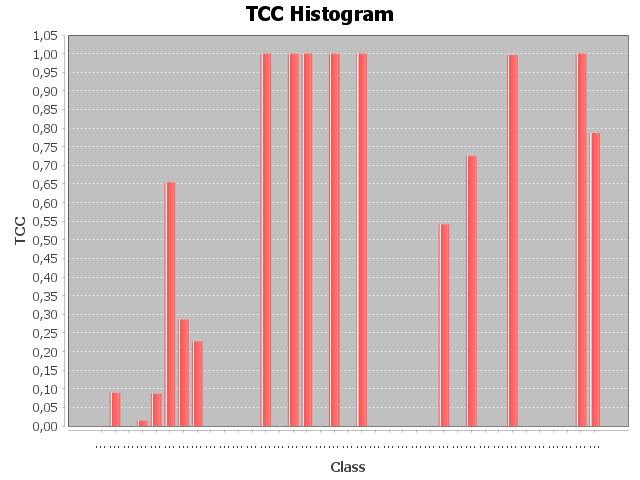

# Report TCC
## Path = Y:\Cours\ESIR2\S1\VV\commons-cli-master\src

> 
> Histogram :
> 
> 

|Class|TCC|
|---|---|
|[org.apache.commons.cli.AlreadySelectedException](./graphs/org.apache.commons.cli.AlreadySelectedException.dot)|0/1 = 0.0|
|[org.apache.commons.cli.CommandLine](./graphs/org.apache.commons.cli.CommandLine.dot)|4/45 = 0.08888888888888889|
|[org.apache.commons.cli.DefaultParser](./graphs/org.apache.commons.cli.DefaultParser.dot)|0/1 = 0.0|
|[org.apache.commons.cli.HelpFormatter](./graphs/org.apache.commons.cli.HelpFormatter.dot)|4/276 = 0.014492753623188406|
|[org.apache.commons.cli.Option](./graphs/org.apache.commons.cli.Option.dot)|43/496 = 0.08669354838709678|
|[org.apache.commons.cli.OptionBuilder](./graphs/org.apache.commons.cli.OptionBuilder.dot)|36/55 = 0.6545454545454545|
|[org.apache.commons.cli.OptionGroup](./graphs/org.apache.commons.cli.OptionGroup.dot)|8/28 = 0.2857142857142857|
|[org.apache.commons.cli.Options](./graphs/org.apache.commons.cli.Options.dot)|15/66 = 0.22727272727272727|
|[org.apache.commons.cli.Parser](./graphs/org.apache.commons.cli.Parser.dot)|0/1 = 0.0|
|[org.apache.commons.cli.PatternOptionBuilder](./graphs/org.apache.commons.cli.PatternOptionBuilder.dot)|0/3 = 0.0|
|[org.apache.commons.cli.TypeHandler](./graphs/org.apache.commons.cli.TypeHandler.dot)|0/36 = 0.0|
|[org.apache.commons.cli.ApplicationTest](./graphs/org.apache.commons.cli.ApplicationTest.dot)|0/10 = 0.0|
|[org.apache.commons.cli.ArgumentIsOptionTest](./graphs/org.apache.commons.cli.ArgumentIsOptionTest.dot)|6/6 = 1.0|
|[org.apache.commons.cli.BasicParserTest](./graphs/org.apache.commons.cli.BasicParserTest.dot)|0/351 = 0.0|
|[org.apache.commons.cli.bug.BugCLI148Test](./graphs/org.apache.commons.cli.bug.BugCLI148Test.dot)|3/3 = 1.0|
|[org.apache.commons.cli.bug.BugCLI162Test](./graphs/org.apache.commons.cli.bug.BugCLI162Test.dot)|10/10 = 1.0|
|[org.apache.commons.cli.bug.BugCLI252Test](./graphs/org.apache.commons.cli.bug.BugCLI252Test.dot)|0/1 = 0.0|
|[org.apache.commons.cli.bug.BugCLI265Test](./graphs/org.apache.commons.cli.bug.BugCLI265Test.dot)|6/6 = 1.0|
|[org.apache.commons.cli.bug.BugCLI266Test](./graphs/org.apache.commons.cli.bug.BugCLI266Test.dot)|0/1 = 0.0|
|[org.apache.commons.cli.bug.BugCLI71Test](./graphs/org.apache.commons.cli.bug.BugCLI71Test.dot)|10/10 = 1.0|
|[org.apache.commons.cli.bug.BugsTest](./graphs/org.apache.commons.cli.bug.BugsTest.dot)|0/66 = 0.0|
|[org.apache.commons.cli.CommandLineTest](./graphs/org.apache.commons.cli.CommandLineTest.dot)|0/28 = 0.0|
|[org.apache.commons.cli.DefaultParserTest](./graphs/org.apache.commons.cli.DefaultParserTest.dot)|0/45 = 0.0|
|[org.apache.commons.cli.DisablePartialMatchingTest](./graphs/org.apache.commons.cli.DisablePartialMatchingTest.dot)|0/1 = 0.0|
|[org.apache.commons.cli.GnuParserTest](./graphs/org.apache.commons.cli.GnuParserTest.dot)|0/231 = 0.0|
|[org.apache.commons.cli.HelpFormatterTest](./graphs/org.apache.commons.cli.HelpFormatterTest.dot)|190/351 = 0.5413105413105413|
|[org.apache.commons.cli.OptionBuilderTest](./graphs/org.apache.commons.cli.OptionBuilderTest.dot)|0/36 = 0.0|
|[org.apache.commons.cli.OptionGroupTest](./graphs/org.apache.commons.cli.OptionGroupTest.dot)|66/91 = 0.7252747252747253|
|[org.apache.commons.cli.OptionsTest](./graphs/org.apache.commons.cli.OptionsTest.dot)|0/45 = 0.0|
|[org.apache.commons.cli.OptionTest](./graphs/org.apache.commons.cli.OptionTest.dot)|0/91 = 0.0|
|[org.apache.commons.cli.ParserTestCase](./graphs/org.apache.commons.cli.ParserTestCase.dot)|1945/1953 = 0.9959037378392217|
|[org.apache.commons.cli.PatternOptionBuilderTest](./graphs/org.apache.commons.cli.PatternOptionBuilderTest.dot)|0/45 = 0.0|
|[org.apache.commons.cli.PosixParserTest](./graphs/org.apache.commons.cli.PosixParserTest.dot)|0/45 = 0.0|
|[org.apache.commons.cli.TypeHandlerTest](./graphs/org.apache.commons.cli.TypeHandlerTest.dot)|0/136 = 0.0|
|[org.apache.commons.cli.UtilTest](./graphs/org.apache.commons.cli.UtilTest.dot)|0/1 = 0.0|
|[org.apache.commons.cli.ValuesTest](./graphs/org.apache.commons.cli.ValuesTest.dot)|28/28 = 1.0|
|[org.apache.commons.cli.ValueTest](./graphs/org.apache.commons.cli.ValueTest.dot)|236/300 = 0.7866666666666666|
