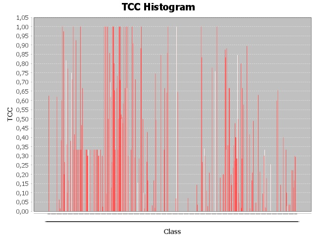

# Report TCC
## Path = Y:\Cours\ESIR2\S1\VV\commons-collections-master\commons-collections-master\src

> 
> Histogram :
> 
> 

|Class|TCC|
|---|---|
|[org.apache.commons.collections4.ArrayStack](./graphs/org.apache.commons.collections4.ArrayStack.dot)|0/10 = 0.0|
|[org.apache.commons.collections4.bag.AbstractBagDecorator](./graphs/org.apache.commons.collections4.bag.AbstractBagDecorator.dot)|0/15 = 0.0|
|[org.apache.commons.collections4.bag.AbstractMapBag](./graphs/org.apache.commons.collections4.bag.AbstractMapBag.dot)|85/136 = 0.625|
|[org.apache.commons.collections4.bag.AbstractSortedBagDecorator](./graphs/org.apache.commons.collections4.bag.AbstractSortedBagDecorator.dot)|0/3 = 0.0|
|[org.apache.commons.collections4.bag.CollectionBag](./graphs/org.apache.commons.collections4.bag.CollectionBag.dot)|0/21 = 0.0|
|[org.apache.commons.collections4.bag.CollectionSortedBag](./graphs/org.apache.commons.collections4.bag.CollectionSortedBag.dot)|0/21 = 0.0|
|[org.apache.commons.collections4.bag.PredicatedBag](./graphs/org.apache.commons.collections4.bag.PredicatedBag.dot)|0/21 = 0.0|
|[org.apache.commons.collections4.bag.PredicatedSortedBag](./graphs/org.apache.commons.collections4.bag.PredicatedSortedBag.dot)|0/6 = 0.0|
|[org.apache.commons.collections4.bag.SynchronizedBag](./graphs/org.apache.commons.collections4.bag.SynchronizedBag.dot)|0/21 = 0.0|
|[org.apache.commons.collections4.bag.SynchronizedSortedBag](./graphs/org.apache.commons.collections4.bag.SynchronizedSortedBag.dot)|0/6 = 0.0|
|[org.apache.commons.collections4.bag.TransformedBag](./graphs/org.apache.commons.collections4.bag.TransformedBag.dot)|0/28 = 0.0|
|[org.apache.commons.collections4.bag.TransformedSortedBag](./graphs/org.apache.commons.collections4.bag.TransformedSortedBag.dot)|0/10 = 0.0|
|[org.apache.commons.collections4.bag.TreeBag](./graphs/org.apache.commons.collections4.bag.TreeBag.dot)|0/6 = 0.0|
|[org.apache.commons.collections4.bag.UnmodifiableBag](./graphs/org.apache.commons.collections4.bag.UnmodifiableBag.dot)|0/45 = 0.0|
|[org.apache.commons.collections4.bag.UnmodifiableSortedBag](./graphs/org.apache.commons.collections4.bag.UnmodifiableSortedBag.dot)|0/45 = 0.0|
|[org.apache.commons.collections4.BagUtils](./graphs/org.apache.commons.collections4.BagUtils.dot)|0/55 = 0.0|
|[org.apache.commons.collections4.bidimap.AbstractBidiMapDecorator](./graphs/org.apache.commons.collections4.bidimap.AbstractBidiMapDecorator.dot)|0/10 = 0.0|
|[org.apache.commons.collections4.bidimap.AbstractDualBidiMap](./graphs/org.apache.commons.collections4.bidimap.AbstractDualBidiMap.dot)|106/171 = 0.6198830409356725|
|[org.apache.commons.collections4.bidimap.AbstractOrderedBidiMapDecorator](./graphs/org.apache.commons.collections4.bidimap.AbstractOrderedBidiMapDecorator.dot)|0/15 = 0.0|
|[org.apache.commons.collections4.bidimap.AbstractSortedBidiMapDecorator](./graphs/org.apache.commons.collections4.bidimap.AbstractSortedBidiMapDecorator.dot)|0/15 = 0.0|
|[org.apache.commons.collections4.bidimap.DualTreeBidiMap](./graphs/org.apache.commons.collections4.bidimap.DualTreeBidiMap.dot)|0/78 = 0.0|
|[org.apache.commons.collections4.bidimap.TreeBidiMap](./graphs/org.apache.commons.collections4.bidimap.TreeBidiMap.dot)|16/253 = 0.06324110671936758|
|[org.apache.commons.collections4.bidimap.UnmodifiableBidiMap](./graphs/org.apache.commons.collections4.bidimap.UnmodifiableBidiMap.dot)|0/55 = 0.0|
|[org.apache.commons.collections4.bidimap.UnmodifiableOrderedBidiMap](./graphs/org.apache.commons.collections4.bidimap.UnmodifiableOrderedBidiMap.dot)|1/66 = 0.015151515151515152|
|[org.apache.commons.collections4.bidimap.UnmodifiableSortedBidiMap](./graphs/org.apache.commons.collections4.bidimap.UnmodifiableSortedBidiMap.dot)|0/91 = 0.0|
|[org.apache.commons.collections4.bloomfilter.ArrayCountingBloomFilter](./graphs/org.apache.commons.collections4.bloomfilter.ArrayCountingBloomFilter.dot)|30/78 = 0.38461538461538464|
|[org.apache.commons.collections4.bloomfilter.BitMap](./graphs/org.apache.commons.collections4.bloomfilter.BitMap.dot)|6/10 = 0.6|
|[org.apache.commons.collections4.bloomfilter.IndexFilter](./graphs/org.apache.commons.collections4.bloomfilter.IndexFilter.dot)|1/1 = 1.0|
|[org.apache.commons.collections4.bloomfilter.SetOperations](./graphs/org.apache.commons.collections4.bloomfilter.SetOperations.dot)|0/36 = 0.0|
|[org.apache.commons.collections4.bloomfilter.Shape](./graphs/org.apache.commons.collections4.bloomfilter.Shape.dot)|76/78 = 0.9743589743589743|
|[org.apache.commons.collections4.bloomfilter.SimpleBloomFilter](./graphs/org.apache.commons.collections4.bloomfilter.SimpleBloomFilter.dot)|11/55 = 0.2|
|[org.apache.commons.collections4.bloomfilter.SparseBloomFilter](./graphs/org.apache.commons.collections4.bloomfilter.SparseBloomFilter.dot)|12/45 = 0.26666666666666666|
|[org.apache.commons.collections4.ClosureUtils](./graphs/org.apache.commons.collections4.ClosureUtils.dot)|0/55 = 0.0|
|[org.apache.commons.collections4.collection.AbstractCollectionDecorator](./graphs/org.apache.commons.collections4.collection.AbstractCollectionDecorator.dot)|0/91 = 0.0|
|[org.apache.commons.collections4.collection.CompositeCollection](./graphs/org.apache.commons.collections4.collection.CompositeCollection.dot)|125/153 = 0.8169934640522876|
|[org.apache.commons.collections4.collection.IndexedCollection](./graphs/org.apache.commons.collections4.collection.IndexedCollection.dot)|33/91 = 0.3626373626373626|
|[org.apache.commons.collections4.collection.PredicatedCollection](./graphs/org.apache.commons.collections4.collection.PredicatedCollection.dot)|1/10 = 0.1|
|[org.apache.commons.collections4.collection.SynchronizedCollection](./graphs/org.apache.commons.collections4.collection.SynchronizedCollection.dot)|105/136 = 0.7720588235294118|
|[org.apache.commons.collections4.collection.TransformedCollection](./graphs/org.apache.commons.collections4.collection.TransformedCollection.dot)|1/6 = 0.16666666666666666|
|[org.apache.commons.collections4.collection.UnmodifiableBoundedCollection](./graphs/org.apache.commons.collections4.collection.UnmodifiableBoundedCollection.dot)|0/55 = 0.0|
|[org.apache.commons.collections4.collection.UnmodifiableCollection](./graphs/org.apache.commons.collections4.collection.UnmodifiableCollection.dot)|0/36 = 0.0|
|[org.apache.commons.collections4.CollectionUtils](./graphs/org.apache.commons.collections4.CollectionUtils.dot)|1/1081 = 9.250693802035153E-4|
|[org.apache.commons.collections4.comparators.BooleanComparator](./graphs/org.apache.commons.collections4.comparators.BooleanComparator.dot)|8/21 = 0.38095238095238093|
|[org.apache.commons.collections4.comparators.ComparableComparator](./graphs/org.apache.commons.collections4.comparators.ComparableComparator.dot)|0/6 = 0.0|
|[org.apache.commons.collections4.comparators.ComparatorChain](./graphs/org.apache.commons.collections4.comparators.ComparatorChain.dot)|27/36 = 0.75|
|[org.apache.commons.collections4.comparators.FixedOrderComparator](./graphs/org.apache.commons.collections4.comparators.FixedOrderComparator.dot)|20/28 = 0.7142857142857143|
|[org.apache.commons.collections4.comparators.NullComparator](./graphs/org.apache.commons.collections4.comparators.NullComparator.dot)|0/3 = 0.0|
|[org.apache.commons.collections4.comparators.ReverseComparator](./graphs/org.apache.commons.collections4.comparators.ReverseComparator.dot)|3/3 = 1.0|
|[org.apache.commons.collections4.comparators.TransformingComparator](./graphs/org.apache.commons.collections4.comparators.TransformingComparator.dot)|1/3 = 0.3333333333333333|
|[org.apache.commons.collections4.ComparatorUtils](./graphs/org.apache.commons.collections4.ComparatorUtils.dot)|15/36 = 0.4166666666666667|
|[org.apache.commons.collections4.EnumerationUtils](./graphs/org.apache.commons.collections4.EnumerationUtils.dot)|0/3 = 0.0|
|[org.apache.commons.collections4.FactoryUtils](./graphs/org.apache.commons.collections4.FactoryUtils.dot)|0/10 = 0.0|
|[org.apache.commons.collections4.FluentIterable](./graphs/org.apache.commons.collections4.FluentIterable.dot)|325/351 = 0.9259259259259259|
|[org.apache.commons.collections4.functors.AllPredicate](./graphs/org.apache.commons.collections4.functors.AllPredicate.dot)|0/1 = 0.0|
|[org.apache.commons.collections4.functors.AndPredicate](./graphs/org.apache.commons.collections4.functors.AndPredicate.dot)|1/3 = 0.3333333333333333|
|[org.apache.commons.collections4.functors.AnyPredicate](./graphs/org.apache.commons.collections4.functors.AnyPredicate.dot)|0/1 = 0.0|
|[org.apache.commons.collections4.functors.ChainedClosure](./graphs/org.apache.commons.collections4.functors.ChainedClosure.dot)|1/3 = 0.3333333333333333|
|[org.apache.commons.collections4.functors.ChainedTransformer](./graphs/org.apache.commons.collections4.functors.ChainedTransformer.dot)|1/3 = 0.3333333333333333|
|[org.apache.commons.collections4.functors.CloneTransformer](./graphs/org.apache.commons.collections4.functors.CloneTransformer.dot)|0/1 = 0.0|
|[org.apache.commons.collections4.functors.ClosureTransformer](./graphs/org.apache.commons.collections4.functors.ClosureTransformer.dot)|1/3 = 0.3333333333333333|
|[org.apache.commons.collections4.functors.ComparatorPredicate](./graphs/org.apache.commons.collections4.functors.ComparatorPredicate.dot)|1/1 = 1.0|
|[org.apache.commons.collections4.functors.ConstantFactory](./graphs/org.apache.commons.collections4.functors.ConstantFactory.dot)|1/3 = 0.3333333333333333|
|[org.apache.commons.collections4.functors.ConstantTransformer](./graphs/org.apache.commons.collections4.functors.ConstantTransformer.dot)|7/15 = 0.4666666666666667|
|[org.apache.commons.collections4.functors.DefaultEquator](./graphs/org.apache.commons.collections4.functors.DefaultEquator.dot)|0/3 = 0.0|
|[org.apache.commons.collections4.functors.EqualPredicate](./graphs/org.apache.commons.collections4.functors.EqualPredicate.dot)|2/3 = 0.6666666666666666|
|[org.apache.commons.collections4.functors.ExceptionClosure](./graphs/org.apache.commons.collections4.functors.ExceptionClosure.dot)|0/1 = 0.0|
|[org.apache.commons.collections4.functors.ExceptionFactory](./graphs/org.apache.commons.collections4.functors.ExceptionFactory.dot)|0/1 = 0.0|
|[org.apache.commons.collections4.functors.ExceptionPredicate](./graphs/org.apache.commons.collections4.functors.ExceptionPredicate.dot)|0/1 = 0.0|
|[org.apache.commons.collections4.functors.ExceptionTransformer](./graphs/org.apache.commons.collections4.functors.ExceptionTransformer.dot)|0/1 = 0.0|
|[org.apache.commons.collections4.functors.FactoryTransformer](./graphs/org.apache.commons.collections4.functors.FactoryTransformer.dot)|1/3 = 0.3333333333333333|
|[org.apache.commons.collections4.functors.FalsePredicate](./graphs/org.apache.commons.collections4.functors.FalsePredicate.dot)|0/1 = 0.0|
|[org.apache.commons.collections4.functors.ForClosure](./graphs/org.apache.commons.collections4.functors.ForClosure.dot)|2/6 = 0.3333333333333333|
|[org.apache.commons.collections4.functors.IdentityPredicate](./graphs/org.apache.commons.collections4.functors.IdentityPredicate.dot)|1/3 = 0.3333333333333333|
|[org.apache.commons.collections4.functors.IfClosure](./graphs/org.apache.commons.collections4.functors.IfClosure.dot)|3/10 = 0.3|
|[org.apache.commons.collections4.functors.IfTransformer](./graphs/org.apache.commons.collections4.functors.IfTransformer.dot)|3/10 = 0.3|
|[org.apache.commons.collections4.functors.InstanceofPredicate](./graphs/org.apache.commons.collections4.functors.InstanceofPredicate.dot)|1/3 = 0.3333333333333333|
|[org.apache.commons.collections4.functors.InstantiateFactory](./graphs/org.apache.commons.collections4.functors.InstantiateFactory.dot)|0/1 = 0.0|
|[org.apache.commons.collections4.functors.InstantiateTransformer](./graphs/org.apache.commons.collections4.functors.InstantiateTransformer.dot)|0/1 = 0.0|
|[org.apache.commons.collections4.functors.InvokerTransformer](./graphs/org.apache.commons.collections4.functors.InvokerTransformer.dot)|0/1 = 0.0|
|[org.apache.commons.collections4.functors.MapTransformer](./graphs/org.apache.commons.collections4.functors.MapTransformer.dot)|1/3 = 0.3333333333333333|
|[org.apache.commons.collections4.functors.NonePredicate](./graphs/org.apache.commons.collections4.functors.NonePredicate.dot)|0/1 = 0.0|
|[org.apache.commons.collections4.functors.NOPClosure](./graphs/org.apache.commons.collections4.functors.NOPClosure.dot)|0/1 = 0.0|
|[org.apache.commons.collections4.functors.NOPTransformer](./graphs/org.apache.commons.collections4.functors.NOPTransformer.dot)|0/1 = 0.0|
|[org.apache.commons.collections4.functors.NotNullPredicate](./graphs/org.apache.commons.collections4.functors.NotNullPredicate.dot)|0/1 = 0.0|
|[org.apache.commons.collections4.functors.NotPredicate](./graphs/org.apache.commons.collections4.functors.NotPredicate.dot)|1/3 = 0.3333333333333333|
|[org.apache.commons.collections4.functors.NullIsExceptionPredicate](./graphs/org.apache.commons.collections4.functors.NullIsExceptionPredicate.dot)|1/3 = 0.3333333333333333|
|[org.apache.commons.collections4.functors.NullIsFalsePredicate](./graphs/org.apache.commons.collections4.functors.NullIsFalsePredicate.dot)|1/3 = 0.3333333333333333|
|[org.apache.commons.collections4.functors.NullIsTruePredicate](./graphs/org.apache.commons.collections4.functors.NullIsTruePredicate.dot)|1/3 = 0.3333333333333333|
|[org.apache.commons.collections4.functors.NullPredicate](./graphs/org.apache.commons.collections4.functors.NullPredicate.dot)|0/1 = 0.0|
|[org.apache.commons.collections4.functors.OnePredicate](./graphs/org.apache.commons.collections4.functors.OnePredicate.dot)|0/1 = 0.0|
|[org.apache.commons.collections4.functors.OrPredicate](./graphs/org.apache.commons.collections4.functors.OrPredicate.dot)|1/3 = 0.3333333333333333|
|[org.apache.commons.collections4.functors.PredicateTransformer](./graphs/org.apache.commons.collections4.functors.PredicateTransformer.dot)|1/3 = 0.3333333333333333|
|[org.apache.commons.collections4.functors.StringValueTransformer](./graphs/org.apache.commons.collections4.functors.StringValueTransformer.dot)|0/1 = 0.0|
|[org.apache.commons.collections4.functors.SwitchClosure](./graphs/org.apache.commons.collections4.functors.SwitchClosure.dot)|3/10 = 0.3|
|[org.apache.commons.collections4.functors.SwitchTransformer](./graphs/org.apache.commons.collections4.functors.SwitchTransformer.dot)|3/10 = 0.3|
|[org.apache.commons.collections4.functors.TransformedPredicate](./graphs/org.apache.commons.collections4.functors.TransformedPredicate.dot)|2/6 = 0.3333333333333333|
|[org.apache.commons.collections4.functors.TransformerClosure](./graphs/org.apache.commons.collections4.functors.TransformerClosure.dot)|1/3 = 0.3333333333333333|
|[org.apache.commons.collections4.functors.TransformerPredicate](./graphs/org.apache.commons.collections4.functors.TransformerPredicate.dot)|1/3 = 0.3333333333333333|
|[org.apache.commons.collections4.functors.TruePredicate](./graphs/org.apache.commons.collections4.functors.TruePredicate.dot)|0/1 = 0.0|
|[org.apache.commons.collections4.functors.UniquePredicate](./graphs/org.apache.commons.collections4.functors.UniquePredicate.dot)|0/1 = 0.0|
|[org.apache.commons.collections4.functors.WhileClosure](./graphs/org.apache.commons.collections4.functors.WhileClosure.dot)|3/10 = 0.3|
|[org.apache.commons.collections4.IterableUtils](./graphs/org.apache.commons.collections4.IterableUtils.dot)|10/406 = 0.024630541871921183|
|[org.apache.commons.collections4.iterators.AbstractEmptyIterator](./graphs/org.apache.commons.collections4.iterators.AbstractEmptyIterator.dot)|0/45 = 0.0|
|[org.apache.commons.collections4.iterators.AbstractEmptyMapIterator](./graphs/org.apache.commons.collections4.iterators.AbstractEmptyMapIterator.dot)|0/3 = 0.0|
|[org.apache.commons.collections4.iterators.AbstractListIteratorDecorator](./graphs/org.apache.commons.collections4.iterators.AbstractListIteratorDecorator.dot)|36/36 = 1.0|
|[org.apache.commons.collections4.iterators.AbstractMapIteratorDecorator](./graphs/org.apache.commons.collections4.iterators.AbstractMapIteratorDecorator.dot)|15/15 = 1.0|
|[org.apache.commons.collections4.iterators.AbstractOrderedMapIteratorDecorator](./graphs/org.apache.commons.collections4.iterators.AbstractOrderedMapIteratorDecorator.dot)|28/28 = 1.0|
|[org.apache.commons.collections4.iterators.AbstractUntypedIteratorDecorator](./graphs/org.apache.commons.collections4.iterators.AbstractUntypedIteratorDecorator.dot)|1/1 = 1.0|
|[org.apache.commons.collections4.iterators.ArrayIterator](./graphs/org.apache.commons.collections4.iterators.ArrayIterator.dot)|2/21 = 0.09523809523809523|
|[org.apache.commons.collections4.iterators.ArrayListIterator](./graphs/org.apache.commons.collections4.iterators.ArrayListIterator.dot)|0/28 = 0.0|
|[org.apache.commons.collections4.iterators.BoundedIterator](./graphs/org.apache.commons.collections4.iterators.BoundedIterator.dot)|3/3 = 1.0|
|[org.apache.commons.collections4.iterators.CollatingIterator](./graphs/org.apache.commons.collections4.iterators.CollatingIterator.dot)|18/36 = 0.5|
|[org.apache.commons.collections4.iterators.EmptyIterator](./graphs/org.apache.commons.collections4.iterators.EmptyIterator.dot)|0/1 = 0.0|
|[org.apache.commons.collections4.iterators.EmptyListIterator](./graphs/org.apache.commons.collections4.iterators.EmptyListIterator.dot)|0/1 = 0.0|
|[org.apache.commons.collections4.iterators.EntrySetMapIterator](./graphs/org.apache.commons.collections4.iterators.EntrySetMapIterator.dot)|24/28 = 0.8571428571428571|
|[org.apache.commons.collections4.iterators.EnumerationIterator](./graphs/org.apache.commons.collections4.iterators.EnumerationIterator.dot)|7/10 = 0.7|
|[org.apache.commons.collections4.iterators.FilterIterator](./graphs/org.apache.commons.collections4.iterators.FilterIterator.dot)|13/21 = 0.6190476190476191|
|[org.apache.commons.collections4.iterators.FilterListIterator](./graphs/org.apache.commons.collections4.iterators.FilterListIterator.dot)|10/78 = 0.1282051282051282|
|[org.apache.commons.collections4.iterators.IteratorChain](./graphs/org.apache.commons.collections4.iterators.IteratorChain.dot)|4/15 = 0.26666666666666666|
|[org.apache.commons.collections4.iterators.IteratorEnumeration](./graphs/org.apache.commons.collections4.iterators.IteratorEnumeration.dot)|6/6 = 1.0|
|[org.apache.commons.collections4.iterators.LazyIteratorChain](./graphs/org.apache.commons.collections4.iterators.LazyIteratorChain.dot)|3/3 = 1.0|
|[org.apache.commons.collections4.iterators.ListIteratorWrapper](./graphs/org.apache.commons.collections4.iterators.ListIteratorWrapper.dot)|45/45 = 1.0|
|[org.apache.commons.collections4.iterators.LoopingIterator](./graphs/org.apache.commons.collections4.iterators.LoopingIterator.dot)|8/10 = 0.8|
|[org.apache.commons.collections4.iterators.LoopingListIterator](./graphs/org.apache.commons.collections4.iterators.LoopingListIterator.dot)|36/55 = 0.6545454545454545|
|[org.apache.commons.collections4.iterators.NodeListIterator](./graphs/org.apache.commons.collections4.iterators.NodeListIterator.dot)|1/3 = 0.3333333333333333|
|[org.apache.commons.collections4.iterators.ObjectArrayIterator](./graphs/org.apache.commons.collections4.iterators.ObjectArrayIterator.dot)|0/21 = 0.0|
|[org.apache.commons.collections4.iterators.ObjectArrayListIterator](./graphs/org.apache.commons.collections4.iterators.ObjectArrayListIterator.dot)|0/28 = 0.0|
|[org.apache.commons.collections4.iterators.ObjectGraphIterator](./graphs/org.apache.commons.collections4.iterators.ObjectGraphIterator.dot)|2/3 = 0.6666666666666666|
|[org.apache.commons.collections4.iterators.PeekingIterator](./graphs/org.apache.commons.collections4.iterators.PeekingIterator.dot)|11/15 = 0.7333333333333333|
|[org.apache.commons.collections4.iterators.PermutationIterator](./graphs/org.apache.commons.collections4.iterators.PermutationIterator.dot)|1/3 = 0.3333333333333333|
|[org.apache.commons.collections4.iterators.PushbackIterator](./graphs/org.apache.commons.collections4.iterators.PushbackIterator.dot)|5/10 = 0.5|
|[org.apache.commons.collections4.iterators.ReverseListIterator](./graphs/org.apache.commons.collections4.iterators.ReverseListIterator.dot)|45/45 = 1.0|
|[org.apache.commons.collections4.iterators.SingletonIterator](./graphs/org.apache.commons.collections4.iterators.SingletonIterator.dot)|6/6 = 1.0|
|[org.apache.commons.collections4.iterators.SingletonListIterator](./graphs/org.apache.commons.collections4.iterators.SingletonListIterator.dot)|32/45 = 0.7111111111111111|
|[org.apache.commons.collections4.iterators.SkippingIterator](./graphs/org.apache.commons.collections4.iterators.SkippingIterator.dot)|1/1 = 1.0|
|[org.apache.commons.collections4.iterators.TransformIterator](./graphs/org.apache.commons.collections4.iterators.TransformIterator.dot)|11/21 = 0.5238095238095238|
|[org.apache.commons.collections4.iterators.UnmodifiableIterator](./graphs/org.apache.commons.collections4.iterators.UnmodifiableIterator.dot)|3/6 = 0.5|
|[org.apache.commons.collections4.iterators.UnmodifiableListIterator](./graphs/org.apache.commons.collections4.iterators.UnmodifiableListIterator.dot)|28/55 = 0.509090909090909|
|[org.apache.commons.collections4.iterators.UnmodifiableMapIterator](./graphs/org.apache.commons.collections4.iterators.UnmodifiableMapIterator.dot)|10/21 = 0.47619047619047616|
|[org.apache.commons.collections4.iterators.UnmodifiableOrderedMapIterator](./graphs/org.apache.commons.collections4.iterators.UnmodifiableOrderedMapIterator.dot)|21/36 = 0.5833333333333334|
|[org.apache.commons.collections4.iterators.ZippingIterator](./graphs/org.apache.commons.collections4.iterators.ZippingIterator.dot)|3/3 = 1.0|
|[org.apache.commons.collections4.IteratorUtils](./graphs/org.apache.commons.collections4.IteratorUtils.dot)|0/1035 = 0.0|
|[org.apache.commons.collections4.keyvalue.AbstractKeyValue](./graphs/org.apache.commons.collections4.keyvalue.AbstractKeyValue.dot)|2/3 = 0.6666666666666666|
|[org.apache.commons.collections4.keyvalue.AbstractMapEntry](./graphs/org.apache.commons.collections4.keyvalue.AbstractMapEntry.dot)|0/3 = 0.0|
|[org.apache.commons.collections4.keyvalue.AbstractMapEntryDecorator](./graphs/org.apache.commons.collections4.keyvalue.AbstractMapEntryDecorator.dot)|15/15 = 1.0|
|[org.apache.commons.collections4.keyvalue.DefaultKeyValue](./graphs/org.apache.commons.collections4.keyvalue.DefaultKeyValue.dot)|0/10 = 0.0|
|[org.apache.commons.collections4.keyvalue.MultiKey](./graphs/org.apache.commons.collections4.keyvalue.MultiKey.dot)|10/15 = 0.6666666666666666|
|[org.apache.commons.collections4.keyvalue.TiedMapEntry](./graphs/org.apache.commons.collections4.keyvalue.TiedMapEntry.dot)|15/15 = 1.0|
|[org.apache.commons.collections4.list.AbstractLinkedList](./graphs/org.apache.commons.collections4.list.AbstractLinkedList.dot)|105/351 = 0.29914529914529914|
|[org.apache.commons.collections4.list.AbstractListDecorator](./graphs/org.apache.commons.collections4.list.AbstractListDecorator.dot)|0/55 = 0.0|
|[org.apache.commons.collections4.list.CursorableLinkedList](./graphs/org.apache.commons.collections4.list.CursorableLinkedList.dot)|0/3 = 0.0|
|[org.apache.commons.collections4.list.FixedSizeList](./graphs/org.apache.commons.collections4.list.FixedSizeList.dot)|0/136 = 0.0|
|[org.apache.commons.collections4.list.GrowthList](./graphs/org.apache.commons.collections4.list.GrowthList.dot)|0/6 = 0.0|
|[org.apache.commons.collections4.list.LazyList](./graphs/org.apache.commons.collections4.list.LazyList.dot)|1/3 = 0.3333333333333333|
|[org.apache.commons.collections4.list.PredicatedList](./graphs/org.apache.commons.collections4.list.PredicatedList.dot)|0/66 = 0.0|
|[org.apache.commons.collections4.list.SetUniqueList](./graphs/org.apache.commons.collections4.list.SetUniqueList.dot)|105/105 = 1.0|
|[org.apache.commons.collections4.list.TransformedList](./graphs/org.apache.commons.collections4.list.TransformedList.dot)|0/78 = 0.0|
|[org.apache.commons.collections4.list.TreeList](./graphs/org.apache.commons.collections4.list.TreeList.dot)|60/66 = 0.9090909090909091|
|[org.apache.commons.collections4.list.UnmodifiableList](./graphs/org.apache.commons.collections4.list.UnmodifiableList.dot)|0/66 = 0.0|
|[org.apache.commons.collections4.ListUtils](./graphs/org.apache.commons.collections4.ListUtils.dot)|0/253 = 0.0|
|[org.apache.commons.collections4.map.AbstractHashedMap](./graphs/org.apache.commons.collections4.map.AbstractHashedMap.dot)|35/120 = 0.2916666666666667|
|[org.apache.commons.collections4.map.AbstractLinkedMap](./graphs/org.apache.commons.collections4.map.AbstractLinkedMap.dot)|15/21 = 0.7142857142857143|
|[org.apache.commons.collections4.map.AbstractMapDecorator](./graphs/org.apache.commons.collections4.map.AbstractMapDecorator.dot)|0/105 = 0.0|
|[org.apache.commons.collections4.map.AbstractOrderedMapDecorator](./graphs/org.apache.commons.collections4.map.AbstractOrderedMapDecorator.dot)|0/10 = 0.0|
|[org.apache.commons.collections4.map.AbstractReferenceMap](./graphs/org.apache.commons.collections4.map.AbstractReferenceMap.dot)|0/66 = 0.0|
|[org.apache.commons.collections4.map.AbstractSortedMapDecorator](./graphs/org.apache.commons.collections4.map.AbstractSortedMapDecorator.dot)|0/36 = 0.0|
|[org.apache.commons.collections4.map.CompositeMap](./graphs/org.apache.commons.collections4.map.CompositeMap.dot)|21/136 = 0.15441176470588236|
|[org.apache.commons.collections4.map.DefaultedMap](./graphs/org.apache.commons.collections4.map.DefaultedMap.dot)|0/1 = 0.0|
|[org.apache.commons.collections4.map.EntrySetToMapIteratorAdapter](./graphs/org.apache.commons.collections4.map.EntrySetToMapIteratorAdapter.dot)|6/21 = 0.2857142857142857|
|[org.apache.commons.collections4.map.FixedSizeMap](./graphs/org.apache.commons.collections4.map.FixedSizeMap.dot)|0/45 = 0.0|
|[org.apache.commons.collections4.map.FixedSizeSortedMap](./graphs/org.apache.commons.collections4.map.FixedSizeSortedMap.dot)|0/78 = 0.0|
|[org.apache.commons.collections4.map.Flat3Map](./graphs/org.apache.commons.collections4.map.Flat3Map.dot)|120/136 = 0.8823529411764706|
|[org.apache.commons.collections4.map.LazyMap](./graphs/org.apache.commons.collections4.map.LazyMap.dot)|1/1 = 1.0|
|[org.apache.commons.collections4.map.LazySortedMap](./graphs/org.apache.commons.collections4.map.LazySortedMap.dot)|0/21 = 0.0|
|[org.apache.commons.collections4.map.LinkedMap](./graphs/org.apache.commons.collections4.map.LinkedMap.dot)|0/15 = 0.0|
|[org.apache.commons.collections4.map.ListOrderedMap](./graphs/org.apache.commons.collections4.map.ListOrderedMap.dot)|105/210 = 0.5|
|[org.apache.commons.collections4.map.LRUMap](./graphs/org.apache.commons.collections4.map.LRUMap.dot)|1/10 = 0.1|
|[org.apache.commons.collections4.map.MultiKeyMap](./graphs/org.apache.commons.collections4.map.MultiKeyMap.dot)|0/36 = 0.0|
|[org.apache.commons.collections4.map.MultiValueMap](./graphs/org.apache.commons.collections4.map.MultiValueMap.dot)|1/66 = 0.015151515151515152|
|[org.apache.commons.collections4.map.PassiveExpiringMap](./graphs/org.apache.commons.collections4.map.PassiveExpiringMap.dot)|6/66 = 0.09090909090909091|
|[org.apache.commons.collections4.map.PredicatedMap](./graphs/org.apache.commons.collections4.map.PredicatedMap.dot)|0/3 = 0.0|
|[org.apache.commons.collections4.map.PredicatedSortedMap](./graphs/org.apache.commons.collections4.map.PredicatedSortedMap.dot)|0/21 = 0.0|
|[org.apache.commons.collections4.map.SingletonMap](./graphs/org.apache.commons.collections4.map.SingletonMap.dot)|87/325 = 0.2676923076923077|
|[org.apache.commons.collections4.map.StaticBucketMap](./graphs/org.apache.commons.collections4.map.StaticBucketMap.dot)|45/105 = 0.42857142857142855|
|[org.apache.commons.collections4.map.TransformedMap](./graphs/org.apache.commons.collections4.map.TransformedMap.dot)|1/6 = 0.16666666666666666|
|[org.apache.commons.collections4.map.TransformedSortedMap](./graphs/org.apache.commons.collections4.map.TransformedSortedMap.dot)|0/28 = 0.0|
|[org.apache.commons.collections4.map.UnmodifiableEntrySet](./graphs/org.apache.commons.collections4.map.UnmodifiableEntrySet.dot)|0/45 = 0.0|
|[org.apache.commons.collections4.map.UnmodifiableMap](./graphs/org.apache.commons.collections4.map.UnmodifiableMap.dot)|0/36 = 0.0|
|[org.apache.commons.collections4.map.UnmodifiableOrderedMap](./graphs/org.apache.commons.collections4.map.UnmodifiableOrderedMap.dot)|0/36 = 0.0|
|[org.apache.commons.collections4.map.UnmodifiableSortedMap](./graphs/org.apache.commons.collections4.map.UnmodifiableSortedMap.dot)|0/91 = 0.0|
|[org.apache.commons.collections4.MapUtils](./graphs/org.apache.commons.collections4.MapUtils.dot)|0/1035 = 0.0|
|[org.apache.commons.collections4.multimap.AbstractListValuedMap](./graphs/org.apache.commons.collections4.multimap.AbstractListValuedMap.dot)|0/1 = 0.0|
|[org.apache.commons.collections4.multimap.AbstractMultiValuedMap](./graphs/org.apache.commons.collections4.multimap.AbstractMultiValuedMap.dot)|6/190 = 0.031578947368421054|
|[org.apache.commons.collections4.multimap.AbstractMultiValuedMapDecorator](./graphs/org.apache.commons.collections4.multimap.AbstractMultiValuedMapDecorator.dot)|0/190 = 0.0|
|[org.apache.commons.collections4.multimap.AbstractSetValuedMap](./graphs/org.apache.commons.collections4.multimap.AbstractSetValuedMap.dot)|0/1 = 0.0|
|[org.apache.commons.collections4.multimap.TransformedMultiValuedMap](./graphs/org.apache.commons.collections4.multimap.TransformedMultiValuedMap.dot)|1/6 = 0.16666666666666666|
|[org.apache.commons.collections4.multimap.UnmodifiableMultiValuedMap](./graphs/org.apache.commons.collections4.multimap.UnmodifiableMultiValuedMap.dot)|0/78 = 0.0|
|[org.apache.commons.collections4.MultiMapUtils](./graphs/org.apache.commons.collections4.MultiMapUtils.dot)|1/55 = 0.01818181818181818|
|[org.apache.commons.collections4.multiset.AbstractMapMultiSet](./graphs/org.apache.commons.collections4.multiset.AbstractMapMultiSet.dot)|41/55 = 0.7454545454545455|
|[org.apache.commons.collections4.multiset.AbstractMultiSet](./graphs/org.apache.commons.collections4.multiset.AbstractMultiSet.dot)|45/91 = 0.4945054945054945|
|[org.apache.commons.collections4.multiset.AbstractMultiSetDecorator](./graphs/org.apache.commons.collections4.multiset.AbstractMultiSetDecorator.dot)|0/28 = 0.0|
|[org.apache.commons.collections4.multiset.PredicatedMultiSet](./graphs/org.apache.commons.collections4.multiset.PredicatedMultiSet.dot)|0/36 = 0.0|
|[org.apache.commons.collections4.multiset.SynchronizedMultiSet](./graphs/org.apache.commons.collections4.multiset.SynchronizedMultiSet.dot)|0/36 = 0.0|
|[org.apache.commons.collections4.multiset.UnmodifiableMultiSet](./graphs/org.apache.commons.collections4.multiset.UnmodifiableMultiSet.dot)|0/66 = 0.0|
|[org.apache.commons.collections4.MultiSetUtils](./graphs/org.apache.commons.collections4.MultiSetUtils.dot)|0/6 = 0.0|
|[org.apache.commons.collections4.PredicateUtils](./graphs/org.apache.commons.collections4.PredicateUtils.dot)|0/276 = 0.0|
|[org.apache.commons.collections4.properties.SortedProperties](./graphs/org.apache.commons.collections4.properties.SortedProperties.dot)|0/1 = 0.0|
|[org.apache.commons.collections4.queue.AbstractQueueDecorator](./graphs/org.apache.commons.collections4.queue.AbstractQueueDecorator.dot)|0/10 = 0.0|
|[org.apache.commons.collections4.queue.CircularFifoQueue](./graphs/org.apache.commons.collections4.queue.CircularFifoQueue.dot)|77/91 = 0.8461538461538461|
|[org.apache.commons.collections4.queue.PredicatedQueue](./graphs/org.apache.commons.collections4.queue.PredicatedQueue.dot)|0/15 = 0.0|
|[org.apache.commons.collections4.queue.SynchronizedQueue](./graphs/org.apache.commons.collections4.queue.SynchronizedQueue.dot)|0/28 = 0.0|
|[org.apache.commons.collections4.queue.TransformedQueue](./graphs/org.apache.commons.collections4.queue.TransformedQueue.dot)|0/21 = 0.0|
|[org.apache.commons.collections4.queue.UnmodifiableQueue](./graphs/org.apache.commons.collections4.queue.UnmodifiableQueue.dot)|0/55 = 0.0|
|[org.apache.commons.collections4.QueueUtils](./graphs/org.apache.commons.collections4.QueueUtils.dot)|0/10 = 0.0|
|[org.apache.commons.collections4.sequence.EditScript](./graphs/org.apache.commons.collections4.sequence.EditScript.dot)|2/6 = 0.3333333333333333|
|[org.apache.commons.collections4.sequence.ReplacementsFinder](./graphs/org.apache.commons.collections4.sequence.ReplacementsFinder.dot)|2/3 = 0.6666666666666666|
|[org.apache.commons.collections4.set.AbstractNavigableSetDecorator](./graphs/org.apache.commons.collections4.set.AbstractNavigableSetDecorator.dot)|0/55 = 0.0|
|[org.apache.commons.collections4.set.AbstractSetDecorator](./graphs/org.apache.commons.collections4.set.AbstractSetDecorator.dot)|0/1 = 0.0|
|[org.apache.commons.collections4.set.AbstractSortedSetDecorator](./graphs/org.apache.commons.collections4.set.AbstractSortedSetDecorator.dot)|0/15 = 0.0|
|[org.apache.commons.collections4.set.CompositeSet](./graphs/org.apache.commons.collections4.set.CompositeSet.dot)|122/190 = 0.6421052631578947|
|[org.apache.commons.collections4.set.ListOrderedSet](./graphs/org.apache.commons.collections4.set.ListOrderedSet.dot)|78/91 = 0.8571428571428571|
|[org.apache.commons.collections4.set.MapBackedSet](./graphs/org.apache.commons.collections4.set.MapBackedSet.dot)|120/120 = 1.0|
|[org.apache.commons.collections4.set.PredicatedNavigableSet](./graphs/org.apache.commons.collections4.set.PredicatedNavigableSet.dot)|0/66 = 0.0|
|[org.apache.commons.collections4.set.PredicatedSet](./graphs/org.apache.commons.collections4.set.PredicatedSet.dot)|0/3 = 0.0|
|[org.apache.commons.collections4.set.PredicatedSortedSet](./graphs/org.apache.commons.collections4.set.PredicatedSortedSet.dot)|0/21 = 0.0|
|[org.apache.commons.collections4.set.TransformedNavigableSet](./graphs/org.apache.commons.collections4.set.TransformedNavigableSet.dot)|0/78 = 0.0|
|[org.apache.commons.collections4.set.TransformedSet](./graphs/org.apache.commons.collections4.set.TransformedSet.dot)|0/6 = 0.0|
|[org.apache.commons.collections4.set.TransformedSortedSet](./graphs/org.apache.commons.collections4.set.TransformedSortedSet.dot)|0/28 = 0.0|
|[org.apache.commons.collections4.set.UnmodifiableNavigableSet](./graphs/org.apache.commons.collections4.set.UnmodifiableNavigableSet.dot)|0/120 = 0.0|
|[org.apache.commons.collections4.set.UnmodifiableSet](./graphs/org.apache.commons.collections4.set.UnmodifiableSet.dot)|0/36 = 0.0|
|[org.apache.commons.collections4.set.UnmodifiableSortedSet](./graphs/org.apache.commons.collections4.set.UnmodifiableSortedSet.dot)|0/66 = 0.0|
|[org.apache.commons.collections4.SetUtils](./graphs/org.apache.commons.collections4.SetUtils.dot)|0/253 = 0.0|
|[org.apache.commons.collections4.splitmap.AbstractIterableGetMapDecorator](./graphs/org.apache.commons.collections4.splitmap.AbstractIterableGetMapDecorator.dot)|0/78 = 0.0|
|[org.apache.commons.collections4.splitmap.TransformedSplitMap](./graphs/org.apache.commons.collections4.splitmap.TransformedSplitMap.dot)|0/6 = 0.0|
|[org.apache.commons.collections4.SplitMapUtils](./graphs/org.apache.commons.collections4.SplitMapUtils.dot)|0/1 = 0.0|
|[org.apache.commons.collections4.TransformerUtils](./graphs/org.apache.commons.collections4.TransformerUtils.dot)|0/91 = 0.0|
|[org.apache.commons.collections4.trie.AbstractPatriciaTrie](./graphs/org.apache.commons.collections4.trie.AbstractPatriciaTrie.dot)|16/231 = 0.06926406926406926|
|[org.apache.commons.collections4.trie.analyzer.StringKeyAnalyzer](./graphs/org.apache.commons.collections4.trie.analyzer.StringKeyAnalyzer.dot)|10/10 = 1.0|
|[org.apache.commons.collections4.trie.KeyAnalyzer](./graphs/org.apache.commons.collections4.trie.KeyAnalyzer.dot)|0/15 = 0.0|
|[org.apache.commons.collections4.trie.UnmodifiableTrie](./graphs/org.apache.commons.collections4.trie.UnmodifiableTrie.dot)|210/325 = 0.6461538461538462|
|[org.apache.commons.collections4.AbstractArrayListTest](./graphs/org.apache.commons.collections4.AbstractArrayListTest.dot)|0/3 = 0.0|
|[org.apache.commons.collections4.AbstractLinkedListTest](./graphs/org.apache.commons.collections4.AbstractLinkedListTest.dot)|0/45 = 0.0|
|[org.apache.commons.collections4.AbstractObjectTest](./graphs/org.apache.commons.collections4.AbstractObjectTest.dot)|0/91 = 0.0|
|[org.apache.commons.collections4.AbstractTreeMapTest](./graphs/org.apache.commons.collections4.AbstractTreeMapTest.dot)|0/6 = 0.0|
|[org.apache.commons.collections4.ArrayStackTest](./graphs/org.apache.commons.collections4.ArrayStackTest.dot)|0/15 = 0.0|
|[org.apache.commons.collections4.bag.AbstractBagTest](./graphs/org.apache.commons.collections4.bag.AbstractBagTest.dot)|0/378 = 0.0|
|[org.apache.commons.collections4.bag.AbstractSortedBagTest](./graphs/org.apache.commons.collections4.bag.AbstractSortedBagTest.dot)|0/45 = 0.0|
|[org.apache.commons.collections4.bag.CollectionBagTest](./graphs/org.apache.commons.collections4.bag.CollectionBagTest.dot)|0/15 = 0.0|
|[org.apache.commons.collections4.bag.CollectionSortedBagTest](./graphs/org.apache.commons.collections4.bag.CollectionSortedBagTest.dot)|0/36 = 0.0|
|[org.apache.commons.collections4.bag.HashBagTest](./graphs/org.apache.commons.collections4.bag.HashBagTest.dot)|0/3 = 0.0|
|[org.apache.commons.collections4.bag.PredicatedBagTest](./graphs/org.apache.commons.collections4.bag.PredicatedBagTest.dot)|0/15 = 0.0|
|[org.apache.commons.collections4.bag.PredicatedSortedBagTest](./graphs/org.apache.commons.collections4.bag.PredicatedSortedBagTest.dot)|0/10 = 0.0|
|[org.apache.commons.collections4.bag.SynchronizedBagTest](./graphs/org.apache.commons.collections4.bag.SynchronizedBagTest.dot)|0/3 = 0.0|
|[org.apache.commons.collections4.bag.TransformedBagTest](./graphs/org.apache.commons.collections4.bag.TransformedBagTest.dot)|0/10 = 0.0|
|[org.apache.commons.collections4.bag.TransformedSortedBagTest](./graphs/org.apache.commons.collections4.bag.TransformedSortedBagTest.dot)|0/10 = 0.0|
|[org.apache.commons.collections4.bag.TreeBagTest](./graphs/org.apache.commons.collections4.bag.TreeBagTest.dot)|0/21 = 0.0|
|[org.apache.commons.collections4.bag.UnmodifiableBagTest](./graphs/org.apache.commons.collections4.bag.UnmodifiableBagTest.dot)|0/45 = 0.0|
|[org.apache.commons.collections4.bag.UnmodifiableSortedBagTest](./graphs/org.apache.commons.collections4.bag.UnmodifiableSortedBagTest.dot)|0/45 = 0.0|
|[org.apache.commons.collections4.BagUtilsTest](./graphs/org.apache.commons.collections4.BagUtilsTest.dot)|2/28 = 0.07142857142857142|
|[org.apache.commons.collections4.bidimap.AbstractBidiMapTest](./graphs/org.apache.commons.collections4.bidimap.AbstractBidiMapTest.dot)|0/210 = 0.0|
|[org.apache.commons.collections4.bidimap.AbstractOrderedBidiMapDecoratorTest](./graphs/org.apache.commons.collections4.bidimap.AbstractOrderedBidiMapDecoratorTest.dot)|0/10 = 0.0|
|[org.apache.commons.collections4.bidimap.AbstractOrderedBidiMapTest](./graphs/org.apache.commons.collections4.bidimap.AbstractOrderedBidiMapTest.dot)|0/15 = 0.0|
|[org.apache.commons.collections4.bidimap.AbstractSortedBidiMapTest](./graphs/org.apache.commons.collections4.bidimap.AbstractSortedBidiMapTest.dot)|0/190 = 0.0|
|[org.apache.commons.collections4.bidimap.DualHashBidiMapTest](./graphs/org.apache.commons.collections4.bidimap.DualHashBidiMapTest.dot)|0/3 = 0.0|
|[org.apache.commons.collections4.bidimap.DualLinkedHashBidiMapTest](./graphs/org.apache.commons.collections4.bidimap.DualLinkedHashBidiMapTest.dot)|0/6 = 0.0|
|[org.apache.commons.collections4.bidimap.DualTreeBidiMap2Test](./graphs/org.apache.commons.collections4.bidimap.DualTreeBidiMap2Test.dot)|0/45 = 0.0|
|[org.apache.commons.collections4.bidimap.DualTreeBidiMapTest](./graphs/org.apache.commons.collections4.bidimap.DualTreeBidiMapTest.dot)|0/3 = 0.0|
|[org.apache.commons.collections4.bidimap.TreeBidiMapTest](./graphs/org.apache.commons.collections4.bidimap.TreeBidiMapTest.dot)|0/28 = 0.0|
|[org.apache.commons.collections4.bidimap.UnmodifiableBidiMapTest](./graphs/org.apache.commons.collections4.bidimap.UnmodifiableBidiMapTest.dot)|0/45 = 0.0|
|[org.apache.commons.collections4.bidimap.UnmodifiableOrderedBidiMapTest](./graphs/org.apache.commons.collections4.bidimap.UnmodifiableOrderedBidiMapTest.dot)|0/66 = 0.0|
|[org.apache.commons.collections4.bidimap.UnmodifiableSortedBidiMapTest](./graphs/org.apache.commons.collections4.bidimap.UnmodifiableSortedBidiMapTest.dot)|0/78 = 0.0|
|[org.apache.commons.collections4.bloomfilter.AbstractBitCountProducerTest](./graphs/org.apache.commons.collections4.bloomfilter.AbstractBitCountProducerTest.dot)|0/15 = 0.0|
|[org.apache.commons.collections4.bloomfilter.AbstractBitMapProducerTest](./graphs/org.apache.commons.collections4.bloomfilter.AbstractBitMapProducerTest.dot)|0/10 = 0.0|
|[org.apache.commons.collections4.bloomfilter.AbstractBloomFilterTest](./graphs/org.apache.commons.collections4.bloomfilter.AbstractBloomFilterTest.dot)|0/91 = 0.0|
|[org.apache.commons.collections4.bloomfilter.AbstractCountingBloomFilterTest](./graphs/org.apache.commons.collections4.bloomfilter.AbstractCountingBloomFilterTest.dot)|3/21 = 0.14285714285714285|
|[org.apache.commons.collections4.bloomfilter.AbstractIndexProducerTest](./graphs/org.apache.commons.collections4.bloomfilter.AbstractIndexProducerTest.dot)|1/28 = 0.03571428571428571|
|[org.apache.commons.collections4.bloomfilter.ArrayHasher](./graphs/org.apache.commons.collections4.bloomfilter.ArrayHasher.dot)|0/1 = 0.0|
|[org.apache.commons.collections4.bloomfilter.BitMapProducerFromLongArrayTest](./graphs/org.apache.commons.collections4.bloomfilter.BitMapProducerFromLongArrayTest.dot)|0/1 = 0.0|
|[org.apache.commons.collections4.bloomfilter.BitMapTest](./graphs/org.apache.commons.collections4.bloomfilter.BitMapTest.dot)|0/10 = 0.0|
|[org.apache.commons.collections4.bloomfilter.DefaultBitMapProducerTest](./graphs/org.apache.commons.collections4.bloomfilter.DefaultBitMapProducerTest.dot)|0/3 = 0.0|
|[org.apache.commons.collections4.bloomfilter.DefaultBloomFilterTest](./graphs/org.apache.commons.collections4.bloomfilter.DefaultBloomFilterTest.dot)|0/21 = 0.0|
|[org.apache.commons.collections4.bloomfilter.DefaultIndexProducerTest](./graphs/org.apache.commons.collections4.bloomfilter.DefaultIndexProducerTest.dot)|0/1 = 0.0|
|[org.apache.commons.collections4.bloomfilter.NullHasher](./graphs/org.apache.commons.collections4.bloomfilter.NullHasher.dot)|1/1 = 1.0|
|[org.apache.commons.collections4.bloomfilter.SetOperationsTest](./graphs/org.apache.commons.collections4.bloomfilter.SetOperationsTest.dot)|55/66 = 0.8333333333333334|
|[org.apache.commons.collections4.bloomfilter.ShapeTest](./graphs/org.apache.commons.collections4.bloomfilter.ShapeTest.dot)|28/105 = 0.26666666666666666|
|[org.apache.commons.collections4.bloomfilter.SparseBloomFilterTest](./graphs/org.apache.commons.collections4.bloomfilter.SparseBloomFilterTest.dot)|0/1 = 0.0|
|[org.apache.commons.collections4.BulkTest](./graphs/org.apache.commons.collections4.BulkTest.dot)|0/6 = 0.0|
|[org.apache.commons.collections4.ClosureUtilsTest](./graphs/org.apache.commons.collections4.ClosureUtilsTest.dot)|0/66 = 0.0|
|[org.apache.commons.collections4.collection.AbstractCollectionTest](./graphs/org.apache.commons.collections4.collection.AbstractCollectionTest.dot)|321/946 = 0.339323467230444|
|[org.apache.commons.collections4.collection.CompositeCollectionTest](./graphs/org.apache.commons.collections4.collection.CompositeCollectionTest.dot)|105/351 = 0.29914529914529914|
|[org.apache.commons.collections4.collection.IndexedCollectionTest](./graphs/org.apache.commons.collections4.collection.IndexedCollectionTest.dot)|0/66 = 0.0|
|[org.apache.commons.collections4.collection.PredicatedCollectionBuilderTest](./graphs/org.apache.commons.collections4.collection.PredicatedCollectionBuilderTest.dot)|0/10 = 0.0|
|[org.apache.commons.collections4.collection.PredicatedCollectionTest](./graphs/org.apache.commons.collections4.collection.PredicatedCollectionTest.dot)|4/36 = 0.1111111111111111|
|[org.apache.commons.collections4.collection.SynchronizedCollectionTest](./graphs/org.apache.commons.collections4.collection.SynchronizedCollectionTest.dot)|0/6 = 0.0|
|[org.apache.commons.collections4.collection.TransformedCollectionTest](./graphs/org.apache.commons.collections4.collection.TransformedCollectionTest.dot)|1/36 = 0.027777777777777776|
|[org.apache.commons.collections4.collection.UnmodifiableBoundedCollectionTest](./graphs/org.apache.commons.collections4.collection.UnmodifiableBoundedCollectionTest.dot)|0/36 = 0.0|
|[org.apache.commons.collections4.collection.UnmodifiableCollectionTest](./graphs/org.apache.commons.collections4.collection.UnmodifiableCollectionTest.dot)|0/36 = 0.0|
|[org.apache.commons.collections4.CollectionUtilsTest](./graphs/org.apache.commons.collections4.CollectionUtilsTest.dot)|2690/12880 = 0.20885093167701863|
|[org.apache.commons.collections4.comparators.AbstractComparatorTest](./graphs/org.apache.commons.collections4.comparators.AbstractComparatorTest.dot)|0/45 = 0.0|
|[org.apache.commons.collections4.comparators.BooleanComparatorTest](./graphs/org.apache.commons.collections4.comparators.BooleanComparatorTest.dot)|0/15 = 0.0|
|[org.apache.commons.collections4.comparators.ComparableComparatorTest](./graphs/org.apache.commons.collections4.comparators.ComparableComparatorTest.dot)|0/3 = 0.0|
|[org.apache.commons.collections4.comparators.ComparatorChainTest](./graphs/org.apache.commons.collections4.comparators.ComparatorChainTest.dot)|0/28 = 0.0|
|[org.apache.commons.collections4.comparators.FixedOrderComparatorTest](./graphs/org.apache.commons.collections4.comparators.FixedOrderComparatorTest.dot)|28/36 = 0.7777777777777778|
|[org.apache.commons.collections4.comparators.ReverseComparatorTest](./graphs/org.apache.commons.collections4.comparators.ReverseComparatorTest.dot)|0/6 = 0.0|
|[org.apache.commons.collections4.comparators.TransformingComparatorTest](./graphs/org.apache.commons.collections4.comparators.TransformingComparatorTest.dot)|0/6 = 0.0|
|[org.apache.commons.collections4.ComparatorUtilsTest](./graphs/org.apache.commons.collections4.ComparatorUtilsTest.dot)|0/15 = 0.0|
|[org.apache.commons.collections4.EnumerationUtilsTest](./graphs/org.apache.commons.collections4.EnumerationUtilsTest.dot)|0/10 = 0.0|
|[org.apache.commons.collections4.FactoryUtilsTest](./graphs/org.apache.commons.collections4.FactoryUtilsTest.dot)|0/120 = 0.0|
|[org.apache.commons.collections4.FluentIterableTest](./graphs/org.apache.commons.collections4.FluentIterableTest.dot)|266/351 = 0.7578347578347578|
|[org.apache.commons.collections4.functors.AbstractAnyAllOnePredicateTest](./graphs/org.apache.commons.collections4.functors.AbstractAnyAllOnePredicateTest.dot)|0/3 = 0.0|
|[org.apache.commons.collections4.functors.AbstractCompositePredicateTest](./graphs/org.apache.commons.collections4.functors.AbstractCompositePredicateTest.dot)|0/21 = 0.0|
|[org.apache.commons.collections4.functors.AbstractMockPredicateTest](./graphs/org.apache.commons.collections4.functors.AbstractMockPredicateTest.dot)|1/1 = 1.0|
|[org.apache.commons.collections4.functors.AbstractPredicateTest](./graphs/org.apache.commons.collections4.functors.AbstractPredicateTest.dot)|0/1 = 0.0|
|[org.apache.commons.collections4.functors.AllPredicateTest](./graphs/org.apache.commons.collections4.functors.AllPredicateTest.dot)|0/15 = 0.0|
|[org.apache.commons.collections4.functors.ComparatorPredicateTest](./graphs/org.apache.commons.collections4.functors.ComparatorPredicateTest.dot)|0/10 = 0.0|
|[org.apache.commons.collections4.functors.EqualPredicateTest](./graphs/org.apache.commons.collections4.functors.EqualPredicateTest.dot)|0/3 = 0.0|
|[org.apache.commons.collections4.functors.NullPredicateTest](./graphs/org.apache.commons.collections4.functors.NullPredicateTest.dot)|0/1 = 0.0|
|[org.apache.commons.collections4.IterableUtilsTest](./graphs/org.apache.commons.collections4.IterableUtilsTest.dot)|42/231 = 0.18181818181818182|
|[org.apache.commons.collections4.iterators.AbstractIteratorTest](./graphs/org.apache.commons.collections4.iterators.AbstractIteratorTest.dot)|0/36 = 0.0|
|[org.apache.commons.collections4.iterators.AbstractListIteratorTest](./graphs/org.apache.commons.collections4.iterators.AbstractListIteratorTest.dot)|0/66 = 0.0|
|[org.apache.commons.collections4.iterators.AbstractMapIteratorTest](./graphs/org.apache.commons.collections4.iterators.AbstractMapIteratorTest.dot)|0/91 = 0.0|
|[org.apache.commons.collections4.iterators.AbstractOrderedMapIteratorTest](./graphs/org.apache.commons.collections4.iterators.AbstractOrderedMapIteratorTest.dot)|0/10 = 0.0|
|[org.apache.commons.collections4.iterators.ArrayIterator2Test](./graphs/org.apache.commons.collections4.iterators.ArrayIterator2Test.dot)|3/15 = 0.2|
|[org.apache.commons.collections4.iterators.ArrayIteratorTest](./graphs/org.apache.commons.collections4.iterators.ArrayIteratorTest.dot)|3/15 = 0.2|
|[org.apache.commons.collections4.iterators.ArrayListIterator2Test](./graphs/org.apache.commons.collections4.iterators.ArrayListIterator2Test.dot)|0/3 = 0.0|
|[org.apache.commons.collections4.iterators.ArrayListIteratorTest](./graphs/org.apache.commons.collections4.iterators.ArrayListIteratorTest.dot)|0/15 = 0.0|
|[org.apache.commons.collections4.iterators.BoundedIteratorTest](./graphs/org.apache.commons.collections4.iterators.BoundedIteratorTest.dot)|105/120 = 0.875|
|[org.apache.commons.collections4.iterators.CollatingIteratorTest](./graphs/org.apache.commons.collections4.iterators.CollatingIteratorTest.dot)|55/66 = 0.8333333333333334|
|[org.apache.commons.collections4.iterators.FilterIteratorTest](./graphs/org.apache.commons.collections4.iterators.FilterIteratorTest.dot)|12/36 = 0.3333333333333333|
|[org.apache.commons.collections4.iterators.FilterListIteratorTest](./graphs/org.apache.commons.collections4.iterators.FilterListIteratorTest.dot)|120/136 = 0.8823529411764706|
|[org.apache.commons.collections4.iterators.IteratorChainTest](./graphs/org.apache.commons.collections4.iterators.IteratorChainTest.dot)|10/28 = 0.35714285714285715|
|[org.apache.commons.collections4.iterators.IteratorIterableTest](./graphs/org.apache.commons.collections4.iterators.IteratorIterableTest.dot)|0/3 = 0.0|
|[org.apache.commons.collections4.iterators.LazyIteratorChainTest](./graphs/org.apache.commons.collections4.iterators.LazyIteratorChainTest.dot)|10/28 = 0.35714285714285715|
|[org.apache.commons.collections4.iterators.ListIteratorWrapper2Test](./graphs/org.apache.commons.collections4.iterators.ListIteratorWrapper2Test.dot)|10/15 = 0.6666666666666666|
|[org.apache.commons.collections4.iterators.ListIteratorWrapperTest](./graphs/org.apache.commons.collections4.iterators.ListIteratorWrapperTest.dot)|10/15 = 0.6666666666666666|
|[org.apache.commons.collections4.iterators.LoopingIteratorTest](./graphs/org.apache.commons.collections4.iterators.LoopingIteratorTest.dot)|0/28 = 0.0|
|[org.apache.commons.collections4.iterators.LoopingListIteratorTest](./graphs/org.apache.commons.collections4.iterators.LoopingListIteratorTest.dot)|0/66 = 0.0|
|[org.apache.commons.collections4.iterators.NodeListIteratorTest](./graphs/org.apache.commons.collections4.iterators.NodeListIteratorTest.dot)|3/15 = 0.2|
|[org.apache.commons.collections4.iterators.ObjectArrayIteratorTest](./graphs/org.apache.commons.collections4.iterators.ObjectArrayIteratorTest.dot)|3/21 = 0.14285714285714285|
|[org.apache.commons.collections4.iterators.ObjectArrayListIterator2Test](./graphs/org.apache.commons.collections4.iterators.ObjectArrayListIterator2Test.dot)|0/10 = 0.0|
|[org.apache.commons.collections4.iterators.ObjectArrayListIteratorTest](./graphs/org.apache.commons.collections4.iterators.ObjectArrayListIteratorTest.dot)|0/10 = 0.0|
|[org.apache.commons.collections4.iterators.ObjectGraphIteratorTest](./graphs/org.apache.commons.collections4.iterators.ObjectGraphIteratorTest.dot)|36/153 = 0.23529411764705882|
|[org.apache.commons.collections4.iterators.PeekingIteratorTest](./graphs/org.apache.commons.collections4.iterators.PeekingIteratorTest.dot)|10/28 = 0.35714285714285715|
|[org.apache.commons.collections4.iterators.PermutationIteratorTest](./graphs/org.apache.commons.collections4.iterators.PermutationIteratorTest.dot)|15/55 = 0.2727272727272727|
|[org.apache.commons.collections4.iterators.PushbackIteratorTest](./graphs/org.apache.commons.collections4.iterators.PushbackIteratorTest.dot)|10/21 = 0.47619047619047616|
|[org.apache.commons.collections4.iterators.ReverseListIteratorTest](./graphs/org.apache.commons.collections4.iterators.ReverseListIteratorTest.dot)|6/15 = 0.4|
|[org.apache.commons.collections4.iterators.SingletonIterator2Test](./graphs/org.apache.commons.collections4.iterators.SingletonIterator2Test.dot)|6/15 = 0.4|
|[org.apache.commons.collections4.iterators.SingletonIteratorTest](./graphs/org.apache.commons.collections4.iterators.SingletonIteratorTest.dot)|6/21 = 0.2857142857142857|
|[org.apache.commons.collections4.iterators.SingletonListIteratorTest](./graphs/org.apache.commons.collections4.iterators.SingletonListIteratorTest.dot)|6/21 = 0.2857142857142857|
|[org.apache.commons.collections4.iterators.SkippingIteratorTest](./graphs/org.apache.commons.collections4.iterators.SkippingIteratorTest.dot)|66/78 = 0.8461538461538461|
|[org.apache.commons.collections4.iterators.UniqueFilterIteratorTest](./graphs/org.apache.commons.collections4.iterators.UniqueFilterIteratorTest.dot)|3/6 = 0.5|
|[org.apache.commons.collections4.iterators.UnmodifiableIteratorTest](./graphs/org.apache.commons.collections4.iterators.UnmodifiableIteratorTest.dot)|1/10 = 0.1|
|[org.apache.commons.collections4.iterators.UnmodifiableListIteratorTest](./graphs/org.apache.commons.collections4.iterators.UnmodifiableListIteratorTest.dot)|1/21 = 0.047619047619047616|
|[org.apache.commons.collections4.iterators.UnmodifiableMapIteratorTest](./graphs/org.apache.commons.collections4.iterators.UnmodifiableMapIteratorTest.dot)|0/28 = 0.0|
|[org.apache.commons.collections4.iterators.UnmodifiableOrderedMapIteratorTest](./graphs/org.apache.commons.collections4.iterators.UnmodifiableOrderedMapIteratorTest.dot)|0/28 = 0.0|
|[org.apache.commons.collections4.iterators.ZippingIteratorTest](./graphs/org.apache.commons.collections4.iterators.ZippingIteratorTest.dot)|36/45 = 0.8|
|[org.apache.commons.collections4.IteratorUtilsTest](./graphs/org.apache.commons.collections4.IteratorUtilsTest.dot)|21/1176 = 0.017857142857142856|
|[org.apache.commons.collections4.keyvalue.AbstractMapEntryTest](./graphs/org.apache.commons.collections4.keyvalue.AbstractMapEntryTest.dot)|6/21 = 0.2857142857142857|
|[org.apache.commons.collections4.keyvalue.DefaultKeyValueTest](./graphs/org.apache.commons.collections4.keyvalue.DefaultKeyValueTest.dot)|10/15 = 0.6666666666666666|
|[org.apache.commons.collections4.keyvalue.DefaultMapEntryTest](./graphs/org.apache.commons.collections4.keyvalue.DefaultMapEntryTest.dot)|0/3 = 0.0|
|[org.apache.commons.collections4.keyvalue.MultiKeyTest](./graphs/org.apache.commons.collections4.keyvalue.MultiKeyTest.dot)|45/78 = 0.5769230769230769|
|[org.apache.commons.collections4.keyvalue.TiedMapEntryTest](./graphs/org.apache.commons.collections4.keyvalue.TiedMapEntryTest.dot)|0/3 = 0.0|
|[org.apache.commons.collections4.keyvalue.UnmodifiableMapEntryTest](./graphs/org.apache.commons.collections4.keyvalue.UnmodifiableMapEntryTest.dot)|0/10 = 0.0|
|[org.apache.commons.collections4.list.AbstractLinkedListTest](./graphs/org.apache.commons.collections4.list.AbstractLinkedListTest.dot)|0/15 = 0.0|
|[org.apache.commons.collections4.list.AbstractListTest](./graphs/org.apache.commons.collections4.list.AbstractListTest.dot)|0/861 = 0.0|
|[org.apache.commons.collections4.list.Collections701Test](./graphs/org.apache.commons.collections4.list.Collections701Test.dot)|0/3 = 0.0|
|[org.apache.commons.collections4.list.CursorableLinkedListTest](./graphs/org.apache.commons.collections4.list.CursorableLinkedListTest.dot)|1378/1540 = 0.8948051948051948|
|[org.apache.commons.collections4.list.FixedSizeListTest](./graphs/org.apache.commons.collections4.list.FixedSizeListTest.dot)|0/66 = 0.0|
|[org.apache.commons.collections4.list.GrowthListTest](./graphs/org.apache.commons.collections4.list.GrowthListTest.dot)|0/66 = 0.0|
|[org.apache.commons.collections4.list.LazyListTest](./graphs/org.apache.commons.collections4.list.LazyListTest.dot)|0/66 = 0.0|
|[org.apache.commons.collections4.list.NodeCachingLinkedListTest](./graphs/org.apache.commons.collections4.list.NodeCachingLinkedListTest.dot)|0/15 = 0.0|
|[org.apache.commons.collections4.list.PredicatedListTest](./graphs/org.apache.commons.collections4.list.PredicatedListTest.dot)|15/36 = 0.4166666666666667|
|[org.apache.commons.collections4.list.SetUniqueListTest](./graphs/org.apache.commons.collections4.list.SetUniqueListTest.dot)|6/378 = 0.015873015873015872|
|[org.apache.commons.collections4.list.TransformedListTest](./graphs/org.apache.commons.collections4.list.TransformedListTest.dot)|0/28 = 0.0|
|[org.apache.commons.collections4.list.TreeListTest](./graphs/org.apache.commons.collections4.list.TreeListTest.dot)|0/55 = 0.0|
|[org.apache.commons.collections4.list.UnmodifiableListTest](./graphs/org.apache.commons.collections4.list.UnmodifiableListTest.dot)|6/36 = 0.16666666666666666|
|[org.apache.commons.collections4.ListUtilsTest](./graphs/org.apache.commons.collections4.ListUtilsTest.dot)|68/325 = 0.20923076923076922|
|[org.apache.commons.collections4.map.AbstractIterableMapTest](./graphs/org.apache.commons.collections4.map.AbstractIterableMapTest.dot)|0/21 = 0.0|
|[org.apache.commons.collections4.map.AbstractMapTest](./graphs/org.apache.commons.collections4.map.AbstractMapTest.dot)|1358/2775 = 0.48936936936936937|
|[org.apache.commons.collections4.map.AbstractOrderedMapTest](./graphs/org.apache.commons.collections4.map.AbstractOrderedMapTest.dot)|0/45 = 0.0|
|[org.apache.commons.collections4.map.AbstractSortedMapTest](./graphs/org.apache.commons.collections4.map.AbstractSortedMapTest.dot)|0/66 = 0.0|
|[org.apache.commons.collections4.map.CaseInsensitiveMapTest](./graphs/org.apache.commons.collections4.map.CaseInsensitiveMapTest.dot)|0/36 = 0.0|
|[org.apache.commons.collections4.map.CompositeMapTest](./graphs/org.apache.commons.collections4.map.CompositeMapTest.dot)|3/66 = 0.045454545454545456|
|[org.apache.commons.collections4.map.DefaultedMapTest](./graphs/org.apache.commons.collections4.map.DefaultedMapTest.dot)|1/21 = 0.047619047619047616|
|[org.apache.commons.collections4.map.EmptyMapMutator](./graphs/org.apache.commons.collections4.map.EmptyMapMutator.dot)|0/3 = 0.0|
|[org.apache.commons.collections4.map.FixedSizeMapTest](./graphs/org.apache.commons.collections4.map.FixedSizeMapTest.dot)|0/10 = 0.0|
|[org.apache.commons.collections4.map.FixedSizeSortedMapTest](./graphs/org.apache.commons.collections4.map.FixedSizeSortedMapTest.dot)|0/21 = 0.0|
|[org.apache.commons.collections4.map.Flat3MapTest](./graphs/org.apache.commons.collections4.map.Flat3MapTest.dot)|741/1176 = 0.6301020408163265|
|[org.apache.commons.collections4.map.HashedMapTest](./graphs/org.apache.commons.collections4.map.HashedMapTest.dot)|0/15 = 0.0|
|[org.apache.commons.collections4.map.LazyMapTest](./graphs/org.apache.commons.collections4.map.LazyMapTest.dot)|0/10 = 0.0|
|[org.apache.commons.collections4.map.LazySortedMapTest](./graphs/org.apache.commons.collections4.map.LazySortedMapTest.dot)|6/28 = 0.21428571428571427|
|[org.apache.commons.collections4.map.LinkedMapTest](./graphs/org.apache.commons.collections4.map.LinkedMapTest.dot)|0/91 = 0.0|
|[org.apache.commons.collections4.map.ListOrderedMap2Test](./graphs/org.apache.commons.collections4.map.ListOrderedMap2Test.dot)|0/45 = 0.0|
|[org.apache.commons.collections4.map.ListOrderedMapTest](./graphs/org.apache.commons.collections4.map.ListOrderedMapTest.dot)|0/190 = 0.0|
|[org.apache.commons.collections4.map.LRUMapTest](./graphs/org.apache.commons.collections4.map.LRUMapTest.dot)|0/231 = 0.0|
|[org.apache.commons.collections4.map.MultiKeyMapTest](./graphs/org.apache.commons.collections4.map.MultiKeyMapTest.dot)|20/210 = 0.09523809523809523|
|[org.apache.commons.collections4.map.MultiValueMapTest](./graphs/org.apache.commons.collections4.map.MultiValueMapTest.dot)|0/435 = 0.0|
|[org.apache.commons.collections4.map.PassiveExpiringMapTest](./graphs/org.apache.commons.collections4.map.PassiveExpiringMapTest.dot)|0/120 = 0.0|
|[org.apache.commons.collections4.map.PredicatedMapTest](./graphs/org.apache.commons.collections4.map.PredicatedMapTest.dot)|3/10 = 0.3|
|[org.apache.commons.collections4.map.PredicatedSortedMapTest](./graphs/org.apache.commons.collections4.map.PredicatedSortedMapTest.dot)|15/45 = 0.3333333333333333|
|[org.apache.commons.collections4.map.ReferenceIdentityMapTest](./graphs/org.apache.commons.collections4.map.ReferenceIdentityMapTest.dot)|1/45 = 0.022222222222222223|
|[org.apache.commons.collections4.map.ReferenceMapTest](./graphs/org.apache.commons.collections4.map.ReferenceMapTest.dot)|1/55 = 0.01818181818181818|
|[org.apache.commons.collections4.map.SingletonMapTest](./graphs/org.apache.commons.collections4.map.SingletonMapTest.dot)|14/78 = 0.1794871794871795|
|[org.apache.commons.collections4.map.StaticBucketMapTest](./graphs/org.apache.commons.collections4.map.StaticBucketMapTest.dot)|0/21 = 0.0|
|[org.apache.commons.collections4.map.TransformedMapTest](./graphs/org.apache.commons.collections4.map.TransformedMapTest.dot)|0/10 = 0.0|
|[org.apache.commons.collections4.map.TransformedSortedMapTest](./graphs/org.apache.commons.collections4.map.TransformedSortedMapTest.dot)|0/28 = 0.0|
|[org.apache.commons.collections4.map.UnmodifiableMapTest](./graphs/org.apache.commons.collections4.map.UnmodifiableMapTest.dot)|0/28 = 0.0|
|[org.apache.commons.collections4.map.UnmodifiableOrderedMapTest](./graphs/org.apache.commons.collections4.map.UnmodifiableOrderedMapTest.dot)|0/28 = 0.0|
|[org.apache.commons.collections4.map.UnmodifiableSortedMapTest](./graphs/org.apache.commons.collections4.map.UnmodifiableSortedMapTest.dot)|0/55 = 0.0|
|[org.apache.commons.collections4.MapUtilsTest](./graphs/org.apache.commons.collections4.MapUtilsTest.dot)|3/2145 = 0.0013986013986013986|
|[org.apache.commons.collections4.multimap.AbstractMultiValuedMapTest](./graphs/org.apache.commons.collections4.multimap.AbstractMultiValuedMapTest.dot)|378/1485 = 0.2545454545454545|
|[org.apache.commons.collections4.multimap.ArrayListValuedHashMapTest](./graphs/org.apache.commons.collections4.multimap.ArrayListValuedHashMapTest.dot)|0/78 = 0.0|
|[org.apache.commons.collections4.multimap.HashSetValuedHashMapTest](./graphs/org.apache.commons.collections4.multimap.HashSetValuedHashMapTest.dot)|0/55 = 0.0|
|[org.apache.commons.collections4.multimap.TransformedMultiValuedMapTest](./graphs/org.apache.commons.collections4.multimap.TransformedMultiValuedMapTest.dot)|0/15 = 0.0|
|[org.apache.commons.collections4.multimap.UnmodifiableMultiValuedMapTest](./graphs/org.apache.commons.collections4.multimap.UnmodifiableMultiValuedMapTest.dot)|0/153 = 0.0|
|[org.apache.commons.collections4.MultiMapUtilsTest](./graphs/org.apache.commons.collections4.MultiMapUtilsTest.dot)|0/45 = 0.0|
|[org.apache.commons.collections4.multiset.AbstractMultiSetTest](./graphs/org.apache.commons.collections4.multiset.AbstractMultiSetTest.dot)|0/406 = 0.0|
|[org.apache.commons.collections4.multiset.HashMultiSetTest](./graphs/org.apache.commons.collections4.multiset.HashMultiSetTest.dot)|0/3 = 0.0|
|[org.apache.commons.collections4.multiset.PredicatedMultiSetTest](./graphs/org.apache.commons.collections4.multiset.PredicatedMultiSetTest.dot)|0/15 = 0.0|
|[org.apache.commons.collections4.multiset.SynchronizedMultiSetTest](./graphs/org.apache.commons.collections4.multiset.SynchronizedMultiSetTest.dot)|0/3 = 0.0|
|[org.apache.commons.collections4.multiset.UnmodifiableMultiSetTest](./graphs/org.apache.commons.collections4.multiset.UnmodifiableMultiSetTest.dot)|0/91 = 0.0|
|[org.apache.commons.collections4.MultiSetUtilsTest](./graphs/org.apache.commons.collections4.MultiSetUtilsTest.dot)|6/10 = 0.6|
|[org.apache.commons.collections4.PredicateUtilsTest](./graphs/org.apache.commons.collections4.PredicateUtilsTest.dot)|0/2016 = 0.0|
|[org.apache.commons.collections4.properties.AbstractPropertiesFactoryTest](./graphs/org.apache.commons.collections4.properties.AbstractPropertiesFactoryTest.dot)|36/55 = 0.6545454545454545|
|[org.apache.commons.collections4.properties.EmptyPropertiesTest](./graphs/org.apache.commons.collections4.properties.EmptyPropertiesTest.dot)|0/1035 = 0.0|
|[org.apache.commons.collections4.properties.SortedPropertiesTest](./graphs/org.apache.commons.collections4.properties.SortedPropertiesTest.dot)|0/1 = 0.0|
|[org.apache.commons.collections4.queue.AbstractQueueTest](./graphs/org.apache.commons.collections4.queue.AbstractQueueTest.dot)|0/120 = 0.0|
|[org.apache.commons.collections4.queue.CircularFifoQueueTest](./graphs/org.apache.commons.collections4.queue.CircularFifoQueueTest.dot)|0/351 = 0.0|
|[org.apache.commons.collections4.queue.PredicatedQueueTest](./graphs/org.apache.commons.collections4.queue.PredicatedQueueTest.dot)|4/28 = 0.14285714285714285|
|[org.apache.commons.collections4.queue.SynchronizedQueueTest](./graphs/org.apache.commons.collections4.queue.SynchronizedQueueTest.dot)|0/6 = 0.0|
|[org.apache.commons.collections4.queue.TransformedQueueTest](./graphs/org.apache.commons.collections4.queue.TransformedQueueTest.dot)|0/21 = 0.0|
|[org.apache.commons.collections4.queue.UnmodifiableQueueTest](./graphs/org.apache.commons.collections4.queue.UnmodifiableQueueTest.dot)|0/91 = 0.0|
|[org.apache.commons.collections4.QueueUtilsTest](./graphs/org.apache.commons.collections4.QueueUtilsTest.dot)|0/10 = 0.0|
|[org.apache.commons.collections4.sequence.SequencesComparatorTest](./graphs/org.apache.commons.collections4.sequence.SequencesComparatorTest.dot)|6/15 = 0.4|
|[org.apache.commons.collections4.set.AbstractNavigableSetTest](./graphs/org.apache.commons.collections4.set.AbstractNavigableSetTest.dot)|0/55 = 0.0|
|[org.apache.commons.collections4.set.AbstractSetTest](./graphs/org.apache.commons.collections4.set.AbstractSetTest.dot)|0/45 = 0.0|
|[org.apache.commons.collections4.set.AbstractSortedSetTest](./graphs/org.apache.commons.collections4.set.AbstractSortedSetTest.dot)|0/66 = 0.0|
|[org.apache.commons.collections4.set.CompositeSetTest](./graphs/org.apache.commons.collections4.set.CompositeSetTest.dot)|0/66 = 0.0|
|[org.apache.commons.collections4.set.EmptySetMutator](./graphs/org.apache.commons.collections4.set.EmptySetMutator.dot)|1/3 = 0.3333333333333333|
|[org.apache.commons.collections4.set.ListOrderedSet2Test](./graphs/org.apache.commons.collections4.set.ListOrderedSet2Test.dot)|1/10 = 0.1|
|[org.apache.commons.collections4.set.ListOrderedSetTest](./graphs/org.apache.commons.collections4.set.ListOrderedSetTest.dot)|1/36 = 0.027777777777777776|
|[org.apache.commons.collections4.set.MapBackedSet2Test](./graphs/org.apache.commons.collections4.set.MapBackedSet2Test.dot)|0/6 = 0.0|
|[org.apache.commons.collections4.set.MapBackedSetTest](./graphs/org.apache.commons.collections4.set.MapBackedSetTest.dot)|0/1 = 0.0|
|[org.apache.commons.collections4.set.PredicatedNavigableSetTest](./graphs/org.apache.commons.collections4.set.PredicatedNavigableSetTest.dot)|1/28 = 0.03571428571428571|
|[org.apache.commons.collections4.set.PredicatedSetTest](./graphs/org.apache.commons.collections4.set.PredicatedSetTest.dot)|0/15 = 0.0|
|[org.apache.commons.collections4.set.PredicatedSortedSetTest](./graphs/org.apache.commons.collections4.set.PredicatedSortedSetTest.dot)|1/28 = 0.03571428571428571|
|[org.apache.commons.collections4.set.TransformedNavigableSetTest](./graphs/org.apache.commons.collections4.set.TransformedNavigableSetTest.dot)|0/15 = 0.0|
|[org.apache.commons.collections4.set.TransformedSetTest](./graphs/org.apache.commons.collections4.set.TransformedSetTest.dot)|0/21 = 0.0|
|[org.apache.commons.collections4.set.TransformedSortedSetTest](./graphs/org.apache.commons.collections4.set.TransformedSortedSetTest.dot)|0/15 = 0.0|
|[org.apache.commons.collections4.set.UnmodifiableNavigableSetTest](./graphs/org.apache.commons.collections4.set.UnmodifiableNavigableSetTest.dot)|10/45 = 0.2222222222222222|
|[org.apache.commons.collections4.set.UnmodifiableSetTest](./graphs/org.apache.commons.collections4.set.UnmodifiableSetTest.dot)|0/28 = 0.0|
|[org.apache.commons.collections4.set.UnmodifiableSortedSetTest](./graphs/org.apache.commons.collections4.set.UnmodifiableSortedSetTest.dot)|10/45 = 0.2222222222222222|
|[org.apache.commons.collections4.SetUtilsTest](./graphs/org.apache.commons.collections4.SetUtilsTest.dot)|10/78 = 0.1282051282051282|
|[org.apache.commons.collections4.splitmap.TransformedSplitMapTest](./graphs/org.apache.commons.collections4.splitmap.TransformedSplitMapTest.dot)|1/6 = 0.16666666666666666|
|[org.apache.commons.collections4.SplitMapUtilsTest](./graphs/org.apache.commons.collections4.SplitMapUtilsTest.dot)|3/10 = 0.3|
|[org.apache.commons.collections4.TransformerUtilsTest](./graphs/org.apache.commons.collections4.TransformerUtilsTest.dot)|45/153 = 0.29411764705882354|
|[org.apache.commons.collections4.trie.PatriciaTrie2Test](./graphs/org.apache.commons.collections4.trie.PatriciaTrie2Test.dot)|0/6 = 0.0|
|[org.apache.commons.collections4.trie.PatriciaTrieTest](./graphs/org.apache.commons.collections4.trie.PatriciaTrieTest.dot)|0/55 = 0.0|
|[org.apache.commons.collections4.trie.UnmodifiableTrieTest](./graphs/org.apache.commons.collections4.trie.UnmodifiableTrieTest.dot)|0/45 = 0.0|
