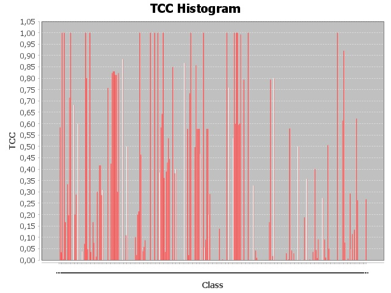

# Report TCC
## Path = Y:\Cours\ESIR2\S1\VV\commons-lang-master\src

> 
> Histogram :
> 
> 

|Class|TCC|
|---|---|
|[org.apache.commons.lang3.AnnotationUtils](./graphs/org.apache.commons.lang3.AnnotationUtils.dot)|0/6 = 0.0|
|[org.apache.commons.lang3.arch.Processor](./graphs/org.apache.commons.lang3.arch.Processor.dot)|21/36 = 0.5833333333333334|
|[org.apache.commons.lang3.ArrayUtils](./graphs/org.apache.commons.lang3.ArrayUtils.dot)|28/820 = 0.03414634146341464|
|[org.apache.commons.lang3.BitField](./graphs/org.apache.commons.lang3.BitField.dot)|136/136 = 1.0|
|[org.apache.commons.lang3.BooleanUtils](./graphs/org.apache.commons.lang3.BooleanUtils.dot)|1/253 = 0.003952569169960474|
|[org.apache.commons.lang3.builder.CompareToBuilder](./graphs/org.apache.commons.lang3.builder.CompareToBuilder.dot)|10/10 = 1.0|
|[org.apache.commons.lang3.builder.Diff](./graphs/org.apache.commons.lang3.builder.Diff.dot)|1/6 = 0.16666666666666666|
|[org.apache.commons.lang3.builder.DiffBuilder](./graphs/org.apache.commons.lang3.builder.DiffBuilder.dot)|0/1 = 0.0|
|[org.apache.commons.lang3.builder.DiffResult](./graphs/org.apache.commons.lang3.builder.DiffResult.dot)|7/21 = 0.3333333333333333|
|[org.apache.commons.lang3.builder.EqualsBuilder](./graphs/org.apache.commons.lang3.builder.EqualsBuilder.dot)|13/66 = 0.19696969696969696|
|[org.apache.commons.lang3.builder.HashCodeBuilder](./graphs/org.apache.commons.lang3.builder.HashCodeBuilder.dot)|15/21 = 0.7142857142857143|
|[org.apache.commons.lang3.builder.IDKey](./graphs/org.apache.commons.lang3.builder.IDKey.dot)|1/1 = 1.0|
|[org.apache.commons.lang3.builder.ReflectionToStringBuilder](./graphs/org.apache.commons.lang3.builder.ReflectionToStringBuilder.dot)|0/120 = 0.0|
|[org.apache.commons.lang3.builder.StandardToStringStyle](./graphs/org.apache.commons.lang3.builder.StandardToStringStyle.dot)|0/780 = 0.0|
|[org.apache.commons.lang3.builder.ToStringBuilder](./graphs/org.apache.commons.lang3.builder.ToStringBuilder.dot)|45/66 = 0.6818181818181818|
|[org.apache.commons.lang3.builder.ToStringStyle](./graphs/org.apache.commons.lang3.builder.ToStringStyle.dot)|3/15 = 0.2|
|[org.apache.commons.lang3.CharRange](./graphs/org.apache.commons.lang3.CharRange.dot)|19/66 = 0.2878787878787879|
|[org.apache.commons.lang3.CharSequenceUtils](./graphs/org.apache.commons.lang3.CharSequenceUtils.dot)|0/1 = 0.0|
|[org.apache.commons.lang3.CharSet](./graphs/org.apache.commons.lang3.CharSet.dot)|6/10 = 0.6|
|[org.apache.commons.lang3.CharSetUtils](./graphs/org.apache.commons.lang3.CharSetUtils.dot)|0/10 = 0.0|
|[org.apache.commons.lang3.CharUtils](./graphs/org.apache.commons.lang3.CharUtils.dot)|0/91 = 0.0|
|[org.apache.commons.lang3.ClassPathUtils](./graphs/org.apache.commons.lang3.ClassPathUtils.dot)|0/6 = 0.0|
|[org.apache.commons.lang3.ClassUtils](./graphs/org.apache.commons.lang3.ClassUtils.dot)|13/351 = 0.037037037037037035|
|[org.apache.commons.lang3.compare.ComparableUtils](./graphs/org.apache.commons.lang3.compare.ComparableUtils.dot)|0/36 = 0.0|
|[org.apache.commons.lang3.concurrent.AbstractCircuitBreaker](./graphs/org.apache.commons.lang3.concurrent.AbstractCircuitBreaker.dot)|2/28 = 0.07142857142857142|
|[org.apache.commons.lang3.concurrent.AbstractFutureProxy](./graphs/org.apache.commons.lang3.concurrent.AbstractFutureProxy.dot)|10/10 = 1.0|
|[org.apache.commons.lang3.concurrent.BackgroundInitializer](./graphs/org.apache.commons.lang3.concurrent.BackgroundInitializer.dot)|12/15 = 0.8|
|[org.apache.commons.lang3.concurrent.BasicThreadFactory](./graphs/org.apache.commons.lang3.concurrent.BasicThreadFactory.dot)|1/21 = 0.047619047619047616|
|[org.apache.commons.lang3.concurrent.ConcurrentUtils](./graphs/org.apache.commons.lang3.concurrent.ConcurrentUtils.dot)|0/45 = 0.0|
|[org.apache.commons.lang3.concurrent.ConstantInitializer](./graphs/org.apache.commons.lang3.concurrent.ConstantInitializer.dot)|10/10 = 1.0|
|[org.apache.commons.lang3.concurrent.EventCountCircuitBreaker](./graphs/org.apache.commons.lang3.concurrent.EventCountCircuitBreaker.dot)|1/28 = 0.03571428571428571|
|[org.apache.commons.lang3.concurrent.locks.LockingVisitors](./graphs/org.apache.commons.lang3.concurrent.locks.LockingVisitors.dot)|0/1 = 0.0|
|[org.apache.commons.lang3.concurrent.ThresholdCircuitBreaker](./graphs/org.apache.commons.lang3.concurrent.ThresholdCircuitBreaker.dot)|1/6 = 0.16666666666666666|
|[org.apache.commons.lang3.concurrent.TimedSemaphore](./graphs/org.apache.commons.lang3.concurrent.TimedSemaphore.dot)|5/66 = 0.07575757575757576|
|[org.apache.commons.lang3.Conversion](./graphs/org.apache.commons.lang3.Conversion.dot)|1/741 = 0.001349527665317139|
|[org.apache.commons.lang3.EnumUtils](./graphs/org.apache.commons.lang3.EnumUtils.dot)|1/66 = 0.015151515151515152|
|[org.apache.commons.lang3.event.EventListenerSupport](./graphs/org.apache.commons.lang3.event.EventListenerSupport.dot)|3/10 = 0.3|
|[org.apache.commons.lang3.event.EventUtils](./graphs/org.apache.commons.lang3.event.EventUtils.dot)|0/1 = 0.0|
|[org.apache.commons.lang3.exception.ContextedException](./graphs/org.apache.commons.lang3.exception.ContextedException.dot)|15/36 = 0.4166666666666667|
|[org.apache.commons.lang3.exception.ContextedRuntimeException](./graphs/org.apache.commons.lang3.exception.ContextedRuntimeException.dot)|15/36 = 0.4166666666666667|
|[org.apache.commons.lang3.exception.DefaultExceptionContext](./graphs/org.apache.commons.lang3.exception.DefaultExceptionContext.dot)|6/21 = 0.2857142857142857|
|[org.apache.commons.lang3.exception.ExceptionUtils](./graphs/org.apache.commons.lang3.exception.ExceptionUtils.dot)|78/253 = 0.308300395256917|
|[org.apache.commons.lang3.function.Failable](./graphs/org.apache.commons.lang3.function.Failable.dot)|0/276 = 0.0|
|[org.apache.commons.lang3.function.MethodInvokers](./graphs/org.apache.commons.lang3.function.MethodInvokers.dot)|0/36 = 0.0|
|[org.apache.commons.lang3.Functions](./graphs/org.apache.commons.lang3.Functions.dot)|0/153 = 0.0|
|[org.apache.commons.lang3.LocaleUtils](./graphs/org.apache.commons.lang3.LocaleUtils.dot)|0/21 = 0.0|
|[org.apache.commons.lang3.math.Fraction](./graphs/org.apache.commons.lang3.math.Fraction.dot)|209/276 = 0.7572463768115942|
|[org.apache.commons.lang3.math.IEEE754rUtils](./graphs/org.apache.commons.lang3.math.IEEE754rUtils.dot)|0/1 = 0.0|
|[org.apache.commons.lang3.math.NumberUtils](./graphs/org.apache.commons.lang3.math.NumberUtils.dot)|0/210 = 0.0|
|[org.apache.commons.lang3.mutable.MutableBoolean](./graphs/org.apache.commons.lang3.mutable.MutableBoolean.dot)|28/66 = 0.42424242424242425|
|[org.apache.commons.lang3.mutable.MutableByte](./graphs/org.apache.commons.lang3.mutable.MutableByte.dot)|190/231 = 0.8225108225108225|
|[org.apache.commons.lang3.mutable.MutableDouble](./graphs/org.apache.commons.lang3.mutable.MutableDouble.dot)|210/253 = 0.8300395256916996|
|[org.apache.commons.lang3.mutable.MutableFloat](./graphs/org.apache.commons.lang3.mutable.MutableFloat.dot)|210/253 = 0.8300395256916996|
|[org.apache.commons.lang3.mutable.MutableInt](./graphs/org.apache.commons.lang3.mutable.MutableInt.dot)|171/210 = 0.8142857142857143|
|[org.apache.commons.lang3.mutable.MutableLong](./graphs/org.apache.commons.lang3.mutable.MutableLong.dot)|171/210 = 0.8142857142857143|
|[org.apache.commons.lang3.mutable.MutableObject](./graphs/org.apache.commons.lang3.mutable.MutableObject.dot)|3/10 = 0.3|
|[org.apache.commons.lang3.mutable.MutableShort](./graphs/org.apache.commons.lang3.mutable.MutableShort.dot)|190/231 = 0.8225108225108225|
|[org.apache.commons.lang3.ObjectUtils](./graphs/org.apache.commons.lang3.ObjectUtils.dot)|0/496 = 0.0|
|[org.apache.commons.lang3.RandomStringUtils](./graphs/org.apache.commons.lang3.RandomStringUtils.dot)|0/21 = 0.0|
|[org.apache.commons.lang3.RandomUtils](./graphs/org.apache.commons.lang3.RandomUtils.dot)|0/15 = 0.0|
|[org.apache.commons.lang3.Range](./graphs/org.apache.commons.lang3.Range.dot)|204/231 = 0.8831168831168831|
|[org.apache.commons.lang3.reflect.ConstructorUtils](./graphs/org.apache.commons.lang3.reflect.ConstructorUtils.dot)|0/6 = 0.0|
|[org.apache.commons.lang3.reflect.FieldUtils](./graphs/org.apache.commons.lang3.reflect.FieldUtils.dot)|0/105 = 0.0|
|[org.apache.commons.lang3.reflect.MethodUtils](./graphs/org.apache.commons.lang3.reflect.MethodUtils.dot)|6/55 = 0.10909090909090909|
|[org.apache.commons.lang3.reflect.TypeLiteral](./graphs/org.apache.commons.lang3.reflect.TypeLiteral.dot)|3/6 = 0.5|
|[org.apache.commons.lang3.reflect.TypeUtils](./graphs/org.apache.commons.lang3.reflect.TypeUtils.dot)|0/231 = 0.0|
|[org.apache.commons.lang3.RegExUtils](./graphs/org.apache.commons.lang3.RegExUtils.dot)|0/15 = 0.0|
|[org.apache.commons.lang3.SerializationUtils](./graphs/org.apache.commons.lang3.SerializationUtils.dot)|0/6 = 0.0|
|[org.apache.commons.lang3.stream.IntStreams](./graphs/org.apache.commons.lang3.stream.IntStreams.dot)|0/1 = 0.0|
|[org.apache.commons.lang3.stream.Streams](./graphs/org.apache.commons.lang3.stream.Streams.dot)|0/15 = 0.0|
|[org.apache.commons.lang3.Streams](./graphs/org.apache.commons.lang3.Streams.dot)|0/1 = 0.0|
|[org.apache.commons.lang3.StringEscapeUtils](./graphs/org.apache.commons.lang3.StringEscapeUtils.dot)|0/120 = 0.0|
|[org.apache.commons.lang3.StringUtils](./graphs/org.apache.commons.lang3.StringUtils.dot)|1066/10585 = 0.1007085498346717|
|[org.apache.commons.lang3.SystemUtils](./graphs/org.apache.commons.lang3.SystemUtils.dot)|1/45 = 0.022222222222222223|
|[org.apache.commons.lang3.text.CompositeFormat](./graphs/org.apache.commons.lang3.text.CompositeFormat.dot)|2/10 = 0.2|
|[org.apache.commons.lang3.text.ExtendedMessageFormat](./graphs/org.apache.commons.lang3.text.ExtendedMessageFormat.dot)|6/28 = 0.21428571428571427|
|[org.apache.commons.lang3.text.FormattableUtils](./graphs/org.apache.commons.lang3.text.FormattableUtils.dot)|1/1 = 1.0|
|[org.apache.commons.lang3.text.StrBuilder](./graphs/org.apache.commons.lang3.text.StrBuilder.dot)|793/1711 = 0.4634716540035067|
|[org.apache.commons.lang3.text.StrLookup](./graphs/org.apache.commons.lang3.text.StrLookup.dot)|0/6 = 0.0|
|[org.apache.commons.lang3.text.StrMatcher](./graphs/org.apache.commons.lang3.text.StrMatcher.dot)|3/78 = 0.038461538461538464|
|[org.apache.commons.lang3.text.StrSubstitutor](./graphs/org.apache.commons.lang3.text.StrSubstitutor.dot)|11/190 = 0.05789473684210526|
|[org.apache.commons.lang3.text.StrTokenizer](./graphs/org.apache.commons.lang3.text.StrTokenizer.dot)|55/630 = 0.0873015873015873|
|[org.apache.commons.lang3.text.translate.CharSequenceTranslator](./graphs/org.apache.commons.lang3.text.translate.CharSequenceTranslator.dot)|0/3 = 0.0|
|[org.apache.commons.lang3.text.translate.EntityArrays](./graphs/org.apache.commons.lang3.text.translate.EntityArrays.dot)|0/55 = 0.0|
|[org.apache.commons.lang3.text.translate.JavaUnicodeEscaper](./graphs/org.apache.commons.lang3.text.translate.JavaUnicodeEscaper.dot)|0/6 = 0.0|
|[org.apache.commons.lang3.text.translate.NumericEntityEscaper](./graphs/org.apache.commons.lang3.text.translate.NumericEntityEscaper.dot)|0/10 = 0.0|
|[org.apache.commons.lang3.text.translate.NumericEntityUnescaper](./graphs/org.apache.commons.lang3.text.translate.NumericEntityUnescaper.dot)|1/1 = 1.0|
|[org.apache.commons.lang3.text.translate.UnicodeEscaper](./graphs/org.apache.commons.lang3.text.translate.UnicodeEscaper.dot)|0/10 = 0.0|
|[org.apache.commons.lang3.text.WordUtils](./graphs/org.apache.commons.lang3.text.WordUtils.dot)|0/21 = 0.0|
|[org.apache.commons.lang3.ThreadUtils](./graphs/org.apache.commons.lang3.ThreadUtils.dot)|0/55 = 0.0|
|[org.apache.commons.lang3.time.CalendarUtils](./graphs/org.apache.commons.lang3.time.CalendarUtils.dot)|6/6 = 1.0|
|[org.apache.commons.lang3.time.DateFormatUtils](./graphs/org.apache.commons.lang3.time.DateFormatUtils.dot)|0/1 = 0.0|
|[org.apache.commons.lang3.time.DateUtils](./graphs/org.apache.commons.lang3.time.DateUtils.dot)|0/496 = 0.0|
|[org.apache.commons.lang3.time.DurationFormatUtils](./graphs/org.apache.commons.lang3.time.DurationFormatUtils.dot)|15/15 = 1.0|
|[org.apache.commons.lang3.time.DurationUtils](./graphs/org.apache.commons.lang3.time.DurationUtils.dot)|0/36 = 0.0|
|[org.apache.commons.lang3.time.FastDateFormat](./graphs/org.apache.commons.lang3.time.FastDateFormat.dot)|35/91 = 0.38461538461538464|
|[org.apache.commons.lang3.time.FastDateParser](./graphs/org.apache.commons.lang3.time.FastDateParser.dot)|21/36 = 0.5833333333333334|
|[org.apache.commons.lang3.time.FastDatePrinter](./graphs/org.apache.commons.lang3.time.FastDatePrinter.dot)|18/28 = 0.6428571428571429|
|[org.apache.commons.lang3.time.FastTimeZone](./graphs/org.apache.commons.lang3.time.FastTimeZone.dot)|1/1 = 1.0|
|[org.apache.commons.lang3.time.GmtTimeZone](./graphs/org.apache.commons.lang3.time.GmtTimeZone.dot)|13/36 = 0.3611111111111111|
|[org.apache.commons.lang3.time.StopWatch](./graphs/org.apache.commons.lang3.time.StopWatch.dot)|9/253 = 0.03557312252964427|
|[org.apache.commons.lang3.tuple.ImmutablePair](./graphs/org.apache.commons.lang3.tuple.ImmutablePair.dot)|14/36 = 0.3888888888888889|
|[org.apache.commons.lang3.tuple.ImmutableTriple](./graphs/org.apache.commons.lang3.tuple.ImmutableTriple.dot)|9/21 = 0.42857142857142855|
|[org.apache.commons.lang3.tuple.MutablePair](./graphs/org.apache.commons.lang3.tuple.MutablePair.dot)|15/28 = 0.5357142857142857|
|[org.apache.commons.lang3.tuple.MutableTriple](./graphs/org.apache.commons.lang3.tuple.MutableTriple.dot)|16/36 = 0.4444444444444444|
|[org.apache.commons.lang3.tuple.Pair](./graphs/org.apache.commons.lang3.tuple.Pair.dot)|0/55 = 0.0|
|[org.apache.commons.lang3.tuple.Triple](./graphs/org.apache.commons.lang3.tuple.Triple.dot)|0/45 = 0.0|
|[org.apache.commons.lang3.util.FluentBitSet](./graphs/org.apache.commons.lang3.util.FluentBitSet.dot)|276/325 = 0.8492307692307692|
|[org.apache.commons.lang3.Validate](./graphs/org.apache.commons.lang3.Validate.dot)|0/91 = 0.0|
|[org.apache.commons.lang3.AnnotationUtilsTest](./graphs/org.apache.commons.lang3.AnnotationUtilsTest.dot)|21/55 = 0.38181818181818183|
|[org.apache.commons.lang3.ArchUtilsTest](./graphs/org.apache.commons.lang3.ArchUtilsTest.dot)|6/15 = 0.4|
|[org.apache.commons.lang3.ArraySorterTest](./graphs/org.apache.commons.lang3.ArraySorterTest.dot)|0/36 = 0.0|
|[org.apache.commons.lang3.ArrayUtilsAddTest](./graphs/org.apache.commons.lang3.ArrayUtilsAddTest.dot)|0/231 = 0.0|
|[org.apache.commons.lang3.ArrayUtilsInsertTest](./graphs/org.apache.commons.lang3.ArrayUtilsInsertTest.dot)|0/36 = 0.0|
|[org.apache.commons.lang3.ArrayUtilsRemoveMultipleTest](./graphs/org.apache.commons.lang3.ArrayUtilsRemoveMultipleTest.dot)|0/1485 = 0.0|
|[org.apache.commons.lang3.ArrayUtilsRemoveTest](./graphs/org.apache.commons.lang3.ArrayUtilsRemoveTest.dot)|0/666 = 0.0|
|[org.apache.commons.lang3.ArrayUtilsSetTest](./graphs/org.apache.commons.lang3.ArrayUtilsSetTest.dot)|0/1 = 0.0|
|[org.apache.commons.lang3.ArrayUtilsTest](./graphs/org.apache.commons.lang3.ArrayUtilsTest.dot)|36/56953 = 6.321001527575369E-4|
|[org.apache.commons.lang3.BitFieldTest](./graphs/org.apache.commons.lang3.BitFieldTest.dot)|91/105 = 0.8666666666666667|
|[org.apache.commons.lang3.BooleanUtilsTest](./graphs/org.apache.commons.lang3.BooleanUtilsTest.dot)|0/4005 = 0.0|
|[org.apache.commons.lang3.builder.CompareToBuilderTest](./graphs/org.apache.commons.lang3.builder.CompareToBuilderTest.dot)|0/1128 = 0.0|
|[org.apache.commons.lang3.builder.DefaultToStringStyleTest](./graphs/org.apache.commons.lang3.builder.DefaultToStringStyleTest.dot)|45/78 = 0.5769230769230769|
|[org.apache.commons.lang3.builder.DiffBuilderTest](./graphs/org.apache.commons.lang3.builder.DiffBuilderTest.dot)|10/465 = 0.021505376344086023|
|[org.apache.commons.lang3.builder.DiffResultTest](./graphs/org.apache.commons.lang3.builder.DiffResultTest.dot)|33/45 = 0.7333333333333333|
|[org.apache.commons.lang3.builder.DiffTest](./graphs/org.apache.commons.lang3.builder.DiffTest.dot)|6/6 = 1.0|
|[org.apache.commons.lang3.builder.EqualsBuilderTest](./graphs/org.apache.commons.lang3.builder.EqualsBuilderTest.dot)|0/1596 = 0.0|
|[org.apache.commons.lang3.builder.HashCodeBuilderAndEqualsBuilderTest](./graphs/org.apache.commons.lang3.builder.HashCodeBuilderAndEqualsBuilderTest.dot)|0/6 = 0.0|
|[org.apache.commons.lang3.builder.HashCodeBuilderTest](./graphs/org.apache.commons.lang3.builder.HashCodeBuilderTest.dot)|0/1035 = 0.0|
|[org.apache.commons.lang3.builder.JsonToStringStyleTest](./graphs/org.apache.commons.lang3.builder.JsonToStringStyleTest.dot)|231/465 = 0.4967741935483871|
|[org.apache.commons.lang3.builder.MultilineRecursiveToStringStyleTest](./graphs/org.apache.commons.lang3.builder.MultilineRecursiveToStringStyleTest.dot)|78/91 = 0.8571428571428571|
|[org.apache.commons.lang3.builder.MultiLineToStringStyleTest](./graphs/org.apache.commons.lang3.builder.MultiLineToStringStyleTest.dot)|45/78 = 0.5769230769230769|
|[org.apache.commons.lang3.builder.NoClassNameToStringStyleTest](./graphs/org.apache.commons.lang3.builder.NoClassNameToStringStyleTest.dot)|45/78 = 0.5769230769230769|
|[org.apache.commons.lang3.builder.NoFieldNamesToStringStyleTest](./graphs/org.apache.commons.lang3.builder.NoFieldNamesToStringStyleTest.dot)|45/78 = 0.5769230769230769|
|[org.apache.commons.lang3.builder.RecursiveToStringStyleTest](./graphs/org.apache.commons.lang3.builder.RecursiveToStringStyleTest.dot)|21/45 = 0.4666666666666667|
|[org.apache.commons.lang3.builder.ReflectionDiffBuilderTest](./graphs/org.apache.commons.lang3.builder.ReflectionDiffBuilderTest.dot)|0/15 = 0.0|
|[org.apache.commons.lang3.builder.ReflectionToStringBuilderConcurrencyTest](./graphs/org.apache.commons.lang3.builder.ReflectionToStringBuilderConcurrencyTest.dot)|0/3 = 0.0|
|[org.apache.commons.lang3.builder.ReflectionToStringBuilderExcludeNullValuesTest](./graphs/org.apache.commons.lang3.builder.ReflectionToStringBuilderExcludeNullValuesTest.dot)|10/10 = 1.0|
|[org.apache.commons.lang3.builder.ReflectionToStringBuilderExcludeTest](./graphs/org.apache.commons.lang3.builder.ReflectionToStringBuilderExcludeTest.dot)|3/55 = 0.05454545454545454|
|[org.apache.commons.lang3.builder.ReflectionToStringBuilderIncludeTest](./graphs/org.apache.commons.lang3.builder.ReflectionToStringBuilderIncludeTest.dot)|17/190 = 0.08947368421052632|
|[org.apache.commons.lang3.builder.ShortPrefixToStringStyleTest](./graphs/org.apache.commons.lang3.builder.ShortPrefixToStringStyleTest.dot)|45/78 = 0.5769230769230769|
|[org.apache.commons.lang3.builder.SimpleToStringStyleTest](./graphs/org.apache.commons.lang3.builder.SimpleToStringStyleTest.dot)|45/78 = 0.5769230769230769|
|[org.apache.commons.lang3.builder.StandardToStringStyleTest](./graphs/org.apache.commons.lang3.builder.StandardToStringStyleTest.dot)|46/231 = 0.19913419913419914|
|[org.apache.commons.lang3.builder.ToStringBuilderTest](./graphs/org.apache.commons.lang3.builder.ToStringBuilderTest.dot)|1326/4560 = 0.29078947368421054|
|[org.apache.commons.lang3.builder.ToStringStyleConcurrencyTest](./graphs/org.apache.commons.lang3.builder.ToStringStyleConcurrencyTest.dot)|0/3 = 0.0|
|[org.apache.commons.lang3.builder.ToStringStyleTest](./graphs/org.apache.commons.lang3.builder.ToStringStyleTest.dot)|0/66 = 0.0|
|[org.apache.commons.lang3.CharEncodingTest](./graphs/org.apache.commons.lang3.CharEncodingTest.dot)|0/10 = 0.0|
|[org.apache.commons.lang3.CharRangeTest](./graphs/org.apache.commons.lang3.CharRangeTest.dot)|0/136 = 0.0|
|[org.apache.commons.lang3.CharSequenceUtilsTest](./graphs/org.apache.commons.lang3.CharSequenceUtilsTest.dot)|0/28 = 0.0|
|[org.apache.commons.lang3.CharsetsTest](./graphs/org.apache.commons.lang3.CharsetsTest.dot)|0/3 = 0.0|
|[org.apache.commons.lang3.CharSetTest](./graphs/org.apache.commons.lang3.CharSetTest.dot)|0/105 = 0.0|
|[org.apache.commons.lang3.CharSetUtilsTest](./graphs/org.apache.commons.lang3.CharSetUtilsTest.dot)|0/55 = 0.0|
|[org.apache.commons.lang3.CharUtilsTest](./graphs/org.apache.commons.lang3.CharUtilsTest.dot)|38/276 = 0.13768115942028986|
|[org.apache.commons.lang3.ClassLoaderUtilsTest](./graphs/org.apache.commons.lang3.ClassLoaderUtilsTest.dot)|0/1 = 0.0|
|[org.apache.commons.lang3.ClassPathUtilsTest](./graphs/org.apache.commons.lang3.ClassPathUtilsTest.dot)|0/105 = 0.0|
|[org.apache.commons.lang3.ClassUtilsTest](./graphs/org.apache.commons.lang3.ClassUtilsTest.dot)|6/2145 = 0.002797202797202797|
|[org.apache.commons.lang3.compare.ComparableUtilsTest](./graphs/org.apache.commons.lang3.compare.ComparableUtilsTest.dot)|0/1 = 0.0|
|[org.apache.commons.lang3.compare.ObjectToStringComparatorTest](./graphs/org.apache.commons.lang3.compare.ObjectToStringComparatorTest.dot)|0/3 = 0.0|
|[org.apache.commons.lang3.concurrent.AbstractConcurrentInitializerTest](./graphs/org.apache.commons.lang3.concurrent.AbstractConcurrentInitializerTest.dot)|0/3 = 0.0|
|[org.apache.commons.lang3.concurrent.AtomicSafeInitializerTest](./graphs/org.apache.commons.lang3.concurrent.AtomicSafeInitializerTest.dot)|1/1 = 1.0|
|[org.apache.commons.lang3.concurrent.BackgroundInitializerTest](./graphs/org.apache.commons.lang3.concurrent.BackgroundInitializerTest.dot)|0/105 = 0.0|
|[org.apache.commons.lang3.concurrent.BasicThreadFactoryTest](./graphs/org.apache.commons.lang3.concurrent.BasicThreadFactoryTest.dot)|91/120 = 0.7583333333333333|
|[org.apache.commons.lang3.concurrent.CallableBackgroundInitializerTest](./graphs/org.apache.commons.lang3.concurrent.CallableBackgroundInitializerTest.dot)|0/6 = 0.0|
|[org.apache.commons.lang3.concurrent.CircuitBreakingExceptionTest](./graphs/org.apache.commons.lang3.concurrent.CircuitBreakingExceptionTest.dot)|0/21 = 0.0|
|[org.apache.commons.lang3.concurrent.ConcurrentUtilsTest](./graphs/org.apache.commons.lang3.concurrent.ConcurrentUtilsTest.dot)|0/820 = 0.0|
|[org.apache.commons.lang3.concurrent.ConstantInitializerTest](./graphs/org.apache.commons.lang3.concurrent.ConstantInitializerTest.dot)|15/28 = 0.5357142857142857|
|[org.apache.commons.lang3.concurrent.EventCountCircuitBreakerTest](./graphs/org.apache.commons.lang3.concurrent.EventCountCircuitBreakerTest.dot)|153/153 = 1.0|
|[org.apache.commons.lang3.concurrent.locks.LockingVisitorsTest](./graphs/org.apache.commons.lang3.concurrent.locks.LockingVisitorsTest.dot)|6/10 = 0.6|
|[org.apache.commons.lang3.concurrent.MemoizerComputableTest](./graphs/org.apache.commons.lang3.concurrent.MemoizerComputableTest.dot)|21/21 = 1.0|
|[org.apache.commons.lang3.concurrent.MemoizerFunctionTest](./graphs/org.apache.commons.lang3.concurrent.MemoizerFunctionTest.dot)|21/21 = 1.0|
|[org.apache.commons.lang3.concurrent.MultiBackgroundInitializerTest](./graphs/org.apache.commons.lang3.concurrent.MultiBackgroundInitializerTest.dot)|91/153 = 0.5947712418300654|
|[org.apache.commons.lang3.concurrent.ThresholdCircuitBreakerTest](./graphs/org.apache.commons.lang3.concurrent.ThresholdCircuitBreakerTest.dot)|6/10 = 0.6|
|[org.apache.commons.lang3.concurrent.TimedSemaphoreTest](./graphs/org.apache.commons.lang3.concurrent.TimedSemaphoreTest.dot)|135/136 = 0.9926470588235294|
|[org.apache.commons.lang3.concurrent.UncheckedFutureTest](./graphs/org.apache.commons.lang3.concurrent.UncheckedFutureTest.dot)|0/28 = 0.0|
|[org.apache.commons.lang3.ConversionTest](./graphs/org.apache.commons.lang3.ConversionTest.dot)|0/946 = 0.0|
|[org.apache.commons.lang3.DoubleRangeTest](./graphs/org.apache.commons.lang3.DoubleRangeTest.dot)|300/378 = 0.7936507936507936|
|[org.apache.commons.lang3.EnumUtilsTest](./graphs/org.apache.commons.lang3.EnumUtilsTest.dot)|0/1035 = 0.0|
|[org.apache.commons.lang3.event.EventListenerSupportTest](./graphs/org.apache.commons.lang3.event.EventListenerSupportTest.dot)|0/45 = 0.0|
|[org.apache.commons.lang3.event.EventUtilsTest](./graphs/org.apache.commons.lang3.event.EventUtilsTest.dot)|0/28 = 0.0|
|[org.apache.commons.lang3.exception.AbstractExceptionContextTest](./graphs/org.apache.commons.lang3.exception.AbstractExceptionContextTest.dot)|28/28 = 1.0|
|[org.apache.commons.lang3.exception.CloneFailedExceptionTest](./graphs/org.apache.commons.lang3.exception.CloneFailedExceptionTest.dot)|0/15 = 0.0|
|[org.apache.commons.lang3.exception.ContextedExceptionTest](./graphs/org.apache.commons.lang3.exception.ContextedExceptionTest.dot)|0/36 = 0.0|
|[org.apache.commons.lang3.exception.ContextedRuntimeExceptionTest](./graphs/org.apache.commons.lang3.exception.ContextedRuntimeExceptionTest.dot)|0/28 = 0.0|
|[org.apache.commons.lang3.exception.DefaultExceptionContextTest](./graphs/org.apache.commons.lang3.exception.DefaultExceptionContextTest.dot)|0/1 = 0.0|
|[org.apache.commons.lang3.exception.ExceptionUtilsTest](./graphs/org.apache.commons.lang3.exception.ExceptionUtilsTest.dot)|487/1485 = 0.32794612794612793|
|[org.apache.commons.lang3.function.BooleanConsumerTest](./graphs/org.apache.commons.lang3.function.BooleanConsumerTest.dot)|0/1 = 0.0|
|[org.apache.commons.lang3.function.FailableFunctionsTest](./graphs/org.apache.commons.lang3.function.FailableFunctionsTest.dot)|549/13041 = 0.04209799861973775|
|[org.apache.commons.lang3.function.MethodFixtures](./graphs/org.apache.commons.lang3.function.MethodFixtures.dot)|1/105 = 0.009523809523809525|
|[org.apache.commons.lang3.function.MethodInvokersBiConsumerTest](./graphs/org.apache.commons.lang3.function.MethodInvokersBiConsumerTest.dot)|0/3 = 0.0|
|[org.apache.commons.lang3.function.MethodInvokersBiFunctionTest](./graphs/org.apache.commons.lang3.function.MethodInvokersBiFunctionTest.dot)|0/10 = 0.0|
|[org.apache.commons.lang3.function.MethodInvokersFailableBiConsumerTest](./graphs/org.apache.commons.lang3.function.MethodInvokersFailableBiConsumerTest.dot)|0/10 = 0.0|
|[org.apache.commons.lang3.function.MethodInvokersFailableBiFunctionTest](./graphs/org.apache.commons.lang3.function.MethodInvokersFailableBiFunctionTest.dot)|0/10 = 0.0|
|[org.apache.commons.lang3.function.MethodInvokersFailableFunctionTest](./graphs/org.apache.commons.lang3.function.MethodInvokersFailableFunctionTest.dot)|0/15 = 0.0|
|[org.apache.commons.lang3.function.MethodInvokersFailableSupplierTest](./graphs/org.apache.commons.lang3.function.MethodInvokersFailableSupplierTest.dot)|0/1 = 0.0|
|[org.apache.commons.lang3.function.MethodInvokersFunctionTest](./graphs/org.apache.commons.lang3.function.MethodInvokersFunctionTest.dot)|0/28 = 0.0|
|[org.apache.commons.lang3.function.MethodInvokersSupplierTest](./graphs/org.apache.commons.lang3.function.MethodInvokersSupplierTest.dot)|0/1 = 0.0|
|[org.apache.commons.lang3.function.TriConsumerTest](./graphs/org.apache.commons.lang3.function.TriConsumerTest.dot)|0/1 = 0.0|
|[org.apache.commons.lang3.function.TriFunctionTest](./graphs/org.apache.commons.lang3.function.TriFunctionTest.dot)|0/1 = 0.0|
|[org.apache.commons.lang3.FunctionsTest](./graphs/org.apache.commons.lang3.FunctionsTest.dot)|0/903 = 0.0|
|[org.apache.commons.lang3.HashSetvBitSetTest](./graphs/org.apache.commons.lang3.HashSetvBitSetTest.dot)|1/6 = 0.16666666666666666|
|[org.apache.commons.lang3.IntegerRangeTest](./graphs/org.apache.commons.lang3.IntegerRangeTest.dot)|300/378 = 0.7936507936507936|
|[org.apache.commons.lang3.JavaVersionTest](./graphs/org.apache.commons.lang3.JavaVersionTest.dot)|0/3 = 0.0|
|[org.apache.commons.lang3.LocaleUtilsTest](./graphs/org.apache.commons.lang3.LocaleUtilsTest.dot)|3/171 = 0.017543859649122806|
|[org.apache.commons.lang3.LongRangeTest](./graphs/org.apache.commons.lang3.LongRangeTest.dot)|325/406 = 0.8004926108374384|
|[org.apache.commons.lang3.math.FractionTest](./graphs/org.apache.commons.lang3.math.FractionTest.dot)|0/300 = 0.0|
|[org.apache.commons.lang3.math.IEEE754rUtilsTest](./graphs/org.apache.commons.lang3.math.IEEE754rUtilsTest.dot)|0/3 = 0.0|
|[org.apache.commons.lang3.math.NumberUtilsTest](./graphs/org.apache.commons.lang3.math.NumberUtilsTest.dot)|0/6328 = 0.0|
|[org.apache.commons.lang3.mutable.MutableBooleanTest](./graphs/org.apache.commons.lang3.mutable.MutableBooleanTest.dot)|0/36 = 0.0|
|[org.apache.commons.lang3.mutable.MutableByteTest](./graphs/org.apache.commons.lang3.mutable.MutableByteTest.dot)|0/300 = 0.0|
|[org.apache.commons.lang3.mutable.MutableDoubleTest](./graphs/org.apache.commons.lang3.mutable.MutableDoubleTest.dot)|0/325 = 0.0|
|[org.apache.commons.lang3.mutable.MutableFloatTest](./graphs/org.apache.commons.lang3.mutable.MutableFloatTest.dot)|0/325 = 0.0|
|[org.apache.commons.lang3.mutable.MutableIntTest](./graphs/org.apache.commons.lang3.mutable.MutableIntTest.dot)|0/300 = 0.0|
|[org.apache.commons.lang3.mutable.MutableLongTest](./graphs/org.apache.commons.lang3.mutable.MutableLongTest.dot)|0/300 = 0.0|
|[org.apache.commons.lang3.mutable.MutableObjectTest](./graphs/org.apache.commons.lang3.mutable.MutableObjectTest.dot)|0/10 = 0.0|
|[org.apache.commons.lang3.mutable.MutableShortTest](./graphs/org.apache.commons.lang3.mutable.MutableShortTest.dot)|0/231 = 0.0|
|[org.apache.commons.lang3.ObjectUtilsTest](./graphs/org.apache.commons.lang3.ObjectUtilsTest.dot)|46/1540 = 0.02987012987012987|
|[org.apache.commons.lang3.RandomStringUtilsTest](./graphs/org.apache.commons.lang3.RandomStringUtilsTest.dot)|0/153 = 0.0|
|[org.apache.commons.lang3.RandomUtilsTest](./graphs/org.apache.commons.lang3.RandomUtilsTest.dot)|1/435 = 0.0022988505747126436|
|[org.apache.commons.lang3.RangeTest](./graphs/org.apache.commons.lang3.RangeTest.dot)|235/406 = 0.5788177339901478|
|[org.apache.commons.lang3.reflect.ConstructorUtilsTest](./graphs/org.apache.commons.lang3.reflect.ConstructorUtilsTest.dot)|0/36 = 0.0|
|[org.apache.commons.lang3.reflect.FieldUtilsTest](./graphs/org.apache.commons.lang3.reflect.FieldUtilsTest.dot)|88/2080 = 0.04230769230769231|
|[org.apache.commons.lang3.reflect.InheritanceUtilsTest](./graphs/org.apache.commons.lang3.reflect.InheritanceUtilsTest.dot)|0/36 = 0.0|
|[org.apache.commons.lang3.reflect.MethodUtilsTest](./graphs/org.apache.commons.lang3.reflect.MethodUtilsTest.dot)|28/946 = 0.02959830866807611|
|[org.apache.commons.lang3.reflect.testbed.GenericParent](./graphs/org.apache.commons.lang3.reflect.testbed.GenericParent.dot)|0/1 = 0.0|
|[org.apache.commons.lang3.reflect.testbed.Parent](./graphs/org.apache.commons.lang3.reflect.testbed.Parent.dot)|0/1 = 0.0|
|[org.apache.commons.lang3.reflect.testbed.PublicChild](./graphs/org.apache.commons.lang3.reflect.testbed.PublicChild.dot)|0/3 = 0.0|
|[org.apache.commons.lang3.reflect.testbed.StaticContainer](./graphs/org.apache.commons.lang3.reflect.testbed.StaticContainer.dot)|3/6 = 0.5|
|[org.apache.commons.lang3.reflect.testbed.StringParameterizedChild](./graphs/org.apache.commons.lang3.reflect.testbed.StringParameterizedChild.dot)|0/6 = 0.0|
|[org.apache.commons.lang3.reflect.TypeLiteralTest](./graphs/org.apache.commons.lang3.reflect.TypeLiteralTest.dot)|0/6 = 0.0|
|[org.apache.commons.lang3.reflect.Test1](./graphs/org.apache.commons.lang3.reflect.Test1.dot)|0/153 = 0.0|
|[org.apache.commons.lang3.reflect.TypeUtilsTest](./graphs/org.apache.commons.lang3.reflect.TypeUtilsTest.dot)|1/528 = 0.001893939393939394|
|[org.apache.commons.lang3.RegExUtilsTest](./graphs/org.apache.commons.lang3.RegExUtilsTest.dot)|0/45 = 0.0|
|[org.apache.commons.lang3.SerializationUtilsTest](./graphs/org.apache.commons.lang3.SerializationUtilsTest.dot)|66/351 = 0.18803418803418803|
|[org.apache.commons.lang3.stream.IntStreamsTest](./graphs/org.apache.commons.lang3.stream.IntStreamsTest.dot)|0/1 = 0.0|
|[org.apache.commons.lang3.stream.LangCollectorsTest](./graphs/org.apache.commons.lang3.stream.LangCollectorsTest.dot)|10/28 = 0.35714285714285715|
|[org.apache.commons.lang3.stream.StreamsTest](./graphs/org.apache.commons.lang3.stream.StreamsTest.dot)|0/190 = 0.0|
|[org.apache.commons.lang3.StreamsTest](./graphs/org.apache.commons.lang3.StreamsTest.dot)|0/21 = 0.0|
|[org.apache.commons.lang3.StringEscapeUtilsTest](./graphs/org.apache.commons.lang3.StringEscapeUtilsTest.dot)|1/496 = 0.0020161290322580645|
|[org.apache.commons.lang3.StringUtilsContainsTest](./graphs/org.apache.commons.lang3.StringUtilsContainsTest.dot)|0/253 = 0.0|
|[org.apache.commons.lang3.StringUtilsEmptyBlankTest](./graphs/org.apache.commons.lang3.StringUtilsEmptyBlankTest.dot)|0/66 = 0.0|
|[org.apache.commons.lang3.StringUtilsEqualsIndexOfTest](./graphs/org.apache.commons.lang3.StringUtilsEqualsIndexOfTest.dot)|24/666 = 0.036036036036036036|
|[org.apache.commons.lang3.StringUtilsIsTest](./graphs/org.apache.commons.lang3.StringUtilsIsTest.dot)|0/28 = 0.0|
|[org.apache.commons.lang3.StringUtilsStartsEndsWithTest](./graphs/org.apache.commons.lang3.StringUtilsStartsEndsWithTest.dot)|6/15 = 0.4|
|[org.apache.commons.lang3.StringUtilsSubstringTest](./graphs/org.apache.commons.lang3.StringUtilsSubstringTest.dot)|6/136 = 0.04411764705882353|
|[org.apache.commons.lang3.StringUtilsTest](./graphs/org.apache.commons.lang3.StringUtilsTest.dot)|109/12561 = 0.008677653053100868|
|[org.apache.commons.lang3.StringUtilsTrimStripTest](./graphs/org.apache.commons.lang3.StringUtilsTrimStripTest.dot)|6/66 = 0.09090909090909091|
|[org.apache.commons.lang3.StringUtilsValueOfTest](./graphs/org.apache.commons.lang3.StringUtilsValueOfTest.dot)|0/3 = 0.0|
|[org.apache.commons.lang3.SystemUtilsTest](./graphs/org.apache.commons.lang3.SystemUtilsTest.dot)|0/190 = 0.0|
|[org.apache.commons.lang3.text.CompositeFormatTest](./graphs/org.apache.commons.lang3.text.CompositeFormatTest.dot)|0/1 = 0.0|
|[org.apache.commons.lang3.text.ExtendedMessageFormatTest](./graphs/org.apache.commons.lang3.text.ExtendedMessageFormatTest.dot)|15/55 = 0.2727272727272727|
|[org.apache.commons.lang3.text.FormattableUtilsTest](./graphs/org.apache.commons.lang3.text.FormattableUtilsTest.dot)|0/10 = 0.0|
|[org.apache.commons.lang3.text.StrBuilderAppendInsertTest](./graphs/org.apache.commons.lang3.text.StrBuilderAppendInsertTest.dot)|115/1275 = 0.09019607843137255|
|[org.apache.commons.lang3.text.StrBuilderTest](./graphs/org.apache.commons.lang3.text.StrBuilderTest.dot)|45/4095 = 0.01098901098901099|
|[org.apache.commons.lang3.text.StrLookupTest](./graphs/org.apache.commons.lang3.text.StrLookupTest.dot)|0/15 = 0.0|
|[org.apache.commons.lang3.text.StrMatcherTest](./graphs/org.apache.commons.lang3.text.StrMatcherTest.dot)|46/91 = 0.5054945054945055|
|[org.apache.commons.lang3.text.StrSubstitutorTest](./graphs/org.apache.commons.lang3.text.StrSubstitutorTest.dot)|45/903 = 0.04983388704318937|
|[org.apache.commons.lang3.text.StrTokenizerTest](./graphs/org.apache.commons.lang3.text.StrTokenizerTest.dot)|1/1485 = 6.734006734006734E-4|
|[org.apache.commons.lang3.text.translate.EntityArraysTest](./graphs/org.apache.commons.lang3.text.translate.EntityArraysTest.dot)|0/3 = 0.0|
|[org.apache.commons.lang3.text.translate.LookupTranslatorTest](./graphs/org.apache.commons.lang3.text.translate.LookupTranslatorTest.dot)|0/1 = 0.0|
|[org.apache.commons.lang3.text.translate.NumericEntityEscaperTest](./graphs/org.apache.commons.lang3.text.translate.NumericEntityEscaperTest.dot)|0/6 = 0.0|
|[org.apache.commons.lang3.text.translate.NumericEntityUnescaperTest](./graphs/org.apache.commons.lang3.text.translate.NumericEntityUnescaperTest.dot)|0/3 = 0.0|
|[org.apache.commons.lang3.text.translate.UnicodeEscaperTest](./graphs/org.apache.commons.lang3.text.translate.UnicodeEscaperTest.dot)|0/3 = 0.0|
|[org.apache.commons.lang3.text.translate.UnicodeUnescaperTest](./graphs/org.apache.commons.lang3.text.translate.UnicodeUnescaperTest.dot)|0/3 = 0.0|
|[org.apache.commons.lang3.text.translate.UnicodeUnpairedSurrogateRemoverTest](./graphs/org.apache.commons.lang3.text.translate.UnicodeUnpairedSurrogateRemoverTest.dot)|1/1 = 1.0|
|[org.apache.commons.lang3.text.WordUtilsTest](./graphs/org.apache.commons.lang3.text.WordUtilsTest.dot)|0/120 = 0.0|
|[org.apache.commons.lang3.ThreadUtilsTest](./graphs/org.apache.commons.lang3.ThreadUtilsTest.dot)|0/406 = 0.0|
|[org.apache.commons.lang3.time.CalendarUtilsTest](./graphs/org.apache.commons.lang3.time.CalendarUtilsTest.dot)|0/15 = 0.0|
|[org.apache.commons.lang3.time.DateFormatUtilsTest](./graphs/org.apache.commons.lang3.time.DateFormatUtilsTest.dot)|0/78 = 0.0|
|[org.apache.commons.lang3.time.DateUtilsFragmentTest](./graphs/org.apache.commons.lang3.time.DateUtilsFragmentTest.dot)|1014/1653 = 0.6134301270417423|
|[org.apache.commons.lang3.time.DateUtilsRoundingTest](./graphs/org.apache.commons.lang3.time.DateUtilsRoundingTest.dot)|233/253 = 0.9209486166007905|
|[org.apache.commons.lang3.time.DateUtilsTest](./graphs/org.apache.commons.lang3.time.DateUtilsTest.dot)|165/2145 = 0.07692307692307693|
|[org.apache.commons.lang3.time.DurationFormatUtilsTest](./graphs/org.apache.commons.lang3.time.DurationFormatUtilsTest.dot)|0/300 = 0.0|
|[org.apache.commons.lang3.time.DurationUtilsTest](./graphs/org.apache.commons.lang3.time.DurationUtilsTest.dot)|0/55 = 0.0|
|[org.apache.commons.lang3.time.FastDateFormatTest](./graphs/org.apache.commons.lang3.time.FastDateFormatTest.dot)|1/153 = 0.006535947712418301|
|[org.apache.commons.lang3.time.FastDateParserSDFTest](./graphs/org.apache.commons.lang3.time.FastDateParserSDFTest.dot)|0/21 = 0.0|
|[org.apache.commons.lang3.time.FastDateParserTest](./graphs/org.apache.commons.lang3.time.FastDateParserTest.dot)|136/465 = 0.2924731182795699|
|[org.apache.commons.lang3.time.FastDateParser_MoreOrLessTest](./graphs/org.apache.commons.lang3.time.FastDateParser_MoreOrLessTest.dot)|1/21 = 0.047619047619047616|
|[org.apache.commons.lang3.time.FastDatePrinterTest](./graphs/org.apache.commons.lang3.time.FastDatePrinterTest.dot)|29/253 = 0.11462450592885376|
|[org.apache.commons.lang3.time.FastDatePrinterTimeZonesTest](./graphs/org.apache.commons.lang3.time.FastDatePrinterTimeZonesTest.dot)|0/1 = 0.0|
|[org.apache.commons.lang3.time.FastTimeZoneTest](./graphs/org.apache.commons.lang3.time.FastTimeZoneTest.dot)|6/45 = 0.13333333333333333|
|[org.apache.commons.lang3.time.GmtTimeZoneTest](./graphs/org.apache.commons.lang3.time.GmtTimeZoneTest.dot)|0/66 = 0.0|
|[org.apache.commons.lang3.time.Java15BugFastDateParserTest](./graphs/org.apache.commons.lang3.time.Java15BugFastDateParserTest.dot)|28/45 = 0.6222222222222222|
|[org.apache.commons.lang3.time.StopWatchTest](./graphs/org.apache.commons.lang3.time.StopWatchTest.dot)|50/190 = 0.2631578947368421|
|[org.apache.commons.lang3.time.WeekYearTest](./graphs/org.apache.commons.lang3.time.WeekYearTest.dot)|0/3 = 0.0|
|[org.apache.commons.lang3.tuple.ImmutablePairTest](./graphs/org.apache.commons.lang3.tuple.ImmutablePairTest.dot)|0/276 = 0.0|
|[org.apache.commons.lang3.tuple.ImmutableTripleTest](./graphs/org.apache.commons.lang3.tuple.ImmutableTripleTest.dot)|0/136 = 0.0|
|[org.apache.commons.lang3.tuple.MutablePairTest](./graphs/org.apache.commons.lang3.tuple.MutablePairTest.dot)|0/66 = 0.0|
|[org.apache.commons.lang3.tuple.MutableTripleTest](./graphs/org.apache.commons.lang3.tuple.MutableTripleTest.dot)|0/55 = 0.0|
|[org.apache.commons.lang3.tuple.PairTest](./graphs/org.apache.commons.lang3.tuple.PairTest.dot)|0/78 = 0.0|
|[org.apache.commons.lang3.tuple.TripleTest](./graphs/org.apache.commons.lang3.tuple.TripleTest.dot)|0/78 = 0.0|
|[org.apache.commons.lang3.util.FluentBitSetTest](./graphs/org.apache.commons.lang3.util.FluentBitSetTest.dot)|253/946 = 0.26744186046511625|
