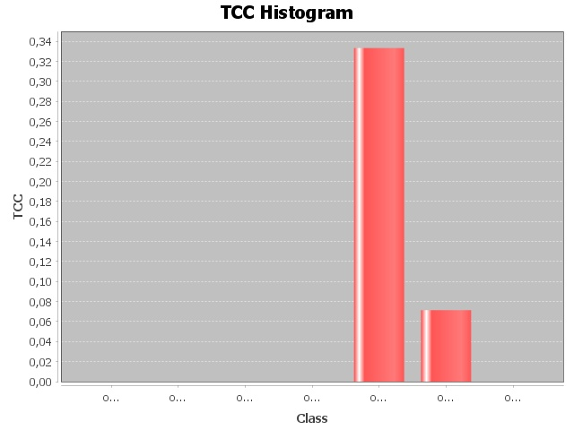

# Report TCC
## Path = Y:\Cours\ESIR2\S1\VV\commons-math-master\src

> 
> Histogram :
> 
> 

|Class|TCC|
|---|---|
|[org.apache.commons.math4.userguide.ClusterAlgorithmComparison](./graphs/org.apache.commons.math4.userguide.ClusterAlgorithmComparison.dot)|0/21 = 0.0|
|[org.apache.commons.math4.userguide.ExampleUtils](./graphs/org.apache.commons.math4.userguide.ExampleUtils.dot)|0/1 = 0.0|
|[org.apache.commons.math4.userguide.filter.CannonballExample](./graphs/org.apache.commons.math4.userguide.filter.CannonballExample.dot)|0/6 = 0.0|
|[org.apache.commons.math4.userguide.filter.ConstantVoltageExample](./graphs/org.apache.commons.math4.userguide.filter.ConstantVoltageExample.dot)|0/6 = 0.0|
|[org.apache.commons.math4.userguide.genetics.Polygon](./graphs/org.apache.commons.math4.userguide.genetics.Polygon.dot)|1/3 = 0.3333333333333333|
|[org.apache.commons.math4.userguide.genetics.PolygonChromosome](./graphs/org.apache.commons.math4.userguide.genetics.PolygonChromosome.dot)|2/28 = 0.07142857142857142|
|[org.apache.commons.math4.userguide.LowDiscrepancyGeneratorComparison](./graphs/org.apache.commons.math4.userguide.LowDiscrepancyGeneratorComparison.dot)|0/6 = 0.0|
